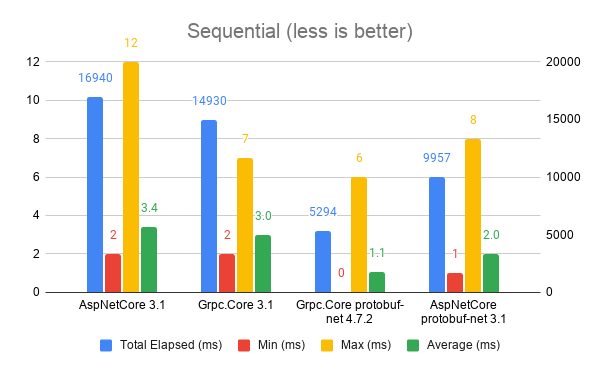

# Overview
Our team implemented Grpc using the protobuf-net package in our backend services to avoid having to mantain .proto files.

We are using a Rest Web API that communicates with our Grpc Services. 

During the Load Tests we performed using https://locust.io/ we encountered unpredictable and very high response times when being executed by concurrent users (simulated by locust)

# Backend services
Here is a list of the services that we have:

- Rest API (.Net Core 3.1)
- Rest Admin API (.Net Core 3.1)
- gRPC Service 1 (.Net Core 3.1)
- gRPC Service 2 (.Net Core 3.1)
- gRPC Service 3 (.Net Framework 4.7.2)

## Services dependency tree

- Rest API
	- gRPC Service 1
		- gRPC Service 3
	- gRPC Service 2
		- gRPC Service 3
- Rest Admin API
	- gRPC Service 1
		- gRPC Service 3


# Performance Tests
To understand the cause of this problem we try to simulate a simple concurrency scenarios using the existing gRPC samples available with some modifications.

We obviously generated 2 types of tests:
- Sequential: one call after another
- Concurrent: multiple calls at the same time

**Note:** Four our concurrent tests we used a `Parallel.For` with a MaxDegreeOfParallelism of 50

Each one of the tests mentioned above were executed in the following way:
- Single Channel to the gRPC Server for all requests
- Creating a new Channel for each request
 
So we are actually doing 4 type of tests:

- Sequential reusing the same gRPC channel
- Sequential using a new gRPC channel
- Concurrent reusing the same gRPC channel
- Concurrent using a new gRPC channel

# Performance metrics captured




## Data
| gRPC Server | Test Type | Total Requests | Total Elapsed (ms) | Min (ms) | Max (ms) | Average (ms) |
| ----------- | --------- | -------------- | ------------------ | -------- | -------- | ------------ |
| .Net Core 3.1 - Grpc.AspNetCore | TestSequential | 5000 | 16940 | 2 | 12 | 3.388 |
| .Net Core 3.1 - Grpc.AspNetCore | TestSequentialReusingGrpcChannel | 5000 | 1949 | 0 | 12 | 0.3898 |
| .Net Core 3.1 - Grpc.AspNetCore | TestConcurrent | 5000 | 27689 | 0 | 2962 | 5.5378 |
| .Net Core 3.1 - Grpc.AspNetCore | TestConcurrentReusingGrpcChannel | 5000 | 738 | 0 | 2962 | 0.1476 |
| .Net Core 3.1 - Grpc.Core | TestSequential | 5000 | 14930 | 2 | 7 | 2.986 |
| .Net Core 3.1 - Grpc.Core | TestSequentialReusingGrpcChannel | 5000 | 1551 | 0 | 7 | 0.3102 |
| .Net Core 3.1 - Grpc.Core | TestConcurrent | 5000 | 1712 | 0 | 19 | 0.3424 |
| .Net Core 3.1 - Grpc.Core | TestConcurrentReusingGrpcChannel | 5000 | 584 | 0 | 19 | 0.1168 |
| .Net Framework 4.7.2 - protobuf-net.Grpc.Native | TestSequential | 5000 | 5294 | 0 | 6 | 1.0588 |
| .Net Framework 4.7.2 - protobuf-net.Grpc.Native | TestSequentialReusingGrpcChannel | 5000 | 2114 | 0 | 6 | 0.4228 |
| .Net Framework 4.7.2 - protobuf-net.Grpc.Native | TestConcurrent | 5000 | 1291 | 0 | 8 | 0.2582 |
| .Net Framework 4.7.2 - protobuf-net.Grpc.Native | TestConcurrentReusingGrpcChannel | 5000 | 395 | 0 | 8 | 0.079 |
| .Net Core 3.1 - protobuf-net.Grpc.AspNetCore | TestSequential | 5000 | 9957 | 1 | 8 | 1.9914 |
| .Net Core 3.1 - protobuf-net.Grpc.AspNetCore | TestSequentialReusingGrpcChannel | 5000 | 1735 | 0 | 8 | 0.347 |
| .Net Core 3.1 - protobuf-net.Grpc.AspNetCore | TestConcurrent | 5000 | 22773 | 0 | 1998 | 4.5546 |
| .Net Core 3.1 - protobuf-net.Grpc.AspNetCore | TestConcurrentReusingGrpcChannel | 5000 | 496 | 0 | 1998 | 0.0992 |


# Conclusions

 - It seems that using Asp.Net Core to host a gRPC server slows severely the performance of the application.
 - We encountered **unpredictable and slow** (specially in conncurrent requests) response times when hosting gRPC in ASP.NET Core
 - Using Grpc.Core Server seems to be more performant


# Available gRPC Samples used

## GrpcGreeter - .Net Core 3.1 - Grpc.AspNetCore

Official Microsoft Asp.Net Core sample: https://github.com/dotnet/AspNetCore.Docs/tree/main/aspnetcore/tutorials/grpc

## grpc - .Net Core 3.1 - Grpc.Core

protobuf-net sample: https://github.com/protobuf-net/protobuf-net.Grpc/tree/main/examples/grpc

## pb-grpc - .Net Framework 4.7.2 - protobuf-net.Grpc.Native

protobuf-net sample: https://github.com/protobuf-net/protobuf-net.Grpc/tree/main/examples/pb-grpc

## pb-net-grpc - .Net Core 3.1/5.0 - protobuf-net.Grpc.AspNetCore

protobuf-net sample: https://github.com/protobuf-net/protobuf-net.Grpc/tree/main/examples/pb-net-grpc

# Results

## GrpcGreeter - .Net Core 3.1 - Grpc.AspNetCore

Run # 1
```
Warmup done
| gRPC Server | Test Type | Total Requests | Total Elapsed (ms) | Min (ms) | Max (ms) | Average (ms) |
| ----------- | --------- | -------------- | ------------------ | -------- | -------- | ------------ |
| .Net Core 3.1 - Grpc.AspNetCore | TestSequential | 5000 | 16940 | 2 | 12 | 3.388 |
| .Net Core 3.1 - Grpc.AspNetCore | TestSequentialReusingGrpcChannel | 5000 | 1949 | 0 | 12 | 0.3898 |
| .Net Core 3.1 - Grpc.AspNetCore | TestConcurrent | 5000 | 27689 | 0 | 2962 | 5.5378 |
| .Net Core 3.1 - Grpc.AspNetCore | TestConcurrentReusingGrpcChannel | 5000 | 738 | 0 | 2962 | 0.1476 |
Press any key to exit...
```

Run # 2
```
Warmup done
| gRPC Server | Test Type | Total Requests | Total Elapsed (ms) | Min (ms) | Max (ms) | Average (ms) |
| ----------- | --------- | -------------- | ------------------ | -------- | -------- | ------------ |
| .Net Core 3.1 - Grpc.AspNetCore | TestSequential | 5000 | 16749 | 2 | 19 | 3.3498 |
| .Net Core 3.1 - Grpc.AspNetCore | TestSequentialReusingGrpcChannel | 5000 | 1929 | 0 | 19 | 0.3858 |
| .Net Core 3.1 - Grpc.AspNetCore | TestConcurrent | 5000 | 30585 | 0 | 2826 | 6.117 |
| .Net Core 3.1 - Grpc.AspNetCore | TestConcurrentReusingGrpcChannel | 5000 | 623 | 0 | 2826 | 0.1246 |
Press any key to exit...
```

### Error encountered one time :(

<details><summary>Show Exception Stack Trace</summary>
<p>

```
Unhandled exception. System.AggregateException: One or more errors occurred. (Status(StatusCode=Internal, Detail="Error starting gRPC call: An error occurred while sending the request.")) (Status(StatusCode=Internal, Detail="Error starting gRPC call: An error occurred while sending the request."))
 ---> Grpc.Core.RpcException: Status(StatusCode=Internal, Detail="Error starting gRPC call: An error occurred while sending the request.")
   at Grpc.Net.Client.Internal.HttpClientCallInvoker.BlockingUnaryCall[TRequest,TResponse](Method`2 method, String host, CallOptions options, TRequest request)
   at Grpc.Core.Interceptors.InterceptingCallInvoker.<BlockingUnaryCall>b__3_0[TRequest,TResponse](TRequest req, ClientInterceptorContext`2 ctx)
   at Grpc.Core.ClientBase.ClientBaseConfiguration.ClientBaseConfigurationInterceptor.BlockingUnaryCall[TRequest,TResponse](TRequest request, ClientInterceptorContext`2 context, BlockingUnaryCallContinuation`2 continuation)
   at Grpc.Core.Interceptors.InterceptingCallInvoker.BlockingUnaryCall[TRequest,TResponse](Method`2 method, String host, CallOptions options, TRequest request)
   at GrpcGreeterClient.Greeter.GreeterClient.GetTime(Empty request, CallOptions options) in C:\Repos\GrpcPerformance\AspNetCore\GrpcGreeterClient\obj\Release\netcoreapp3.1\GreetGrpc.cs:line 116
   at GrpcGreeterClient.Greeter.GreeterClient.GetTime(Empty request, Metadata headers, Nullable`1 deadline, CancellationToken cancellationToken) in C:\Repos\GrpcPerformance\AspNetCore\GrpcGreeterClient\obj\Release\netcoreapp3.1\GreetGrpc.cs:line 112
   at GrpcGreeterClient.Program.<>c__DisplayClass14_0.<TestConcurrentReusingGrpcChannel>b__0(Int32 i) in C:\Repos\GrpcPerformance\AspNetCore\GrpcGreeterClient\Program.cs:line 151
   at System.Threading.Tasks.Parallel.<>c__DisplayClass19_0`1.<ForWorker>b__1(RangeWorker& currentWorker, Int32 timeout, Boolean& replicationDelegateYieldedBeforeCompletion)
--- End of stack trace from previous location where exception was thrown ---
   at System.Runtime.ExceptionServices.ExceptionDispatchInfo.Throw(Exception source)
   at System.Threading.Tasks.Parallel.<>c__DisplayClass19_0`1.<ForWorker>b__1(RangeWorker& currentWorker, Int32 timeout, Boolean& replicationDelegateYieldedBeforeCompletion)
   at System.Threading.Tasks.TaskReplicator.Replica`1.ExecuteAction(Boolean& yieldedBeforeCompletion)
   at System.Threading.Tasks.TaskReplicator.Replica.Execute()
   --- End of inner exception stack trace ---
   at System.Threading.Tasks.TaskReplicator.Run[TState](ReplicatableUserAction`1 action, ParallelOptions options, Boolean stopOnFirstFailure)
   at System.Threading.Tasks.Parallel.ForWorker[TLocal](Int32 fromInclusive, Int32 toExclusive, ParallelOptions parallelOptions, Action`1 body, Action`2 bodyWithState, Func`4 bodyWithLocal, Func`1 localInit, Action`1 localFinally)
--- End of stack trace from previous location where exception was thrown ---
   at System.Runtime.ExceptionServices.ExceptionDispatchInfo.Throw(Exception source)
   at System.Threading.Tasks.Parallel.ThrowSingleCancellationExceptionOrOtherException(ICollection exceptions, CancellationToken cancelToken, Exception otherException)
   at System.Threading.Tasks.Parallel.ForWorker[TLocal](Int32 fromInclusive, Int32 toExclusive, ParallelOptions parallelOptions, Action`1 body, Action`2 bodyWithState, Func`4 bodyWithLocal, Func`1 localInit, Action`1 localFinally)
   at System.Threading.Tasks.Parallel.For(Int32 fromInclusive, Int32 toExclusive, ParallelOptions parallelOptions, Action`1 body)
   at GrpcGreeterClient.Program.TestConcurrentReusingGrpcChannel() in C:\Repos\GrpcPerformance\AspNetCore\GrpcGreeterClient\Program.cs:line 156
   at GrpcGreeterClient.Program.Main(String[] args) in C:\Repos\GrpcPerformance\AspNetCore\GrpcGreeterClient\Program.cs:line 26
 ---> (Inner Exception #1) Grpc.Core.RpcException: Status(StatusCode=Internal, Detail="Error starting gRPC call: An error occurred while sending the request.")
   at Grpc.Net.Client.Internal.HttpClientCallInvoker.BlockingUnaryCall[TRequest,TResponse](Method`2 method, String host, CallOptions options, TRequest request)
   at Grpc.Core.Interceptors.InterceptingCallInvoker.<BlockingUnaryCall>b__3_0[TRequest,TResponse](TRequest req, ClientInterceptorContext`2 ctx)
   at Grpc.Core.ClientBase.ClientBaseConfiguration.ClientBaseConfigurationInterceptor.BlockingUnaryCall[TRequest,TResponse](TRequest request, ClientInterceptorContext`2 context, BlockingUnaryCallContinuation`2 continuation)
   at Grpc.Core.Interceptors.InterceptingCallInvoker.BlockingUnaryCall[TRequest,TResponse](Method`2 method, String host, CallOptions options, TRequest request)
   at GrpcGreeterClient.Greeter.GreeterClient.GetTime(Empty request, CallOptions options) in C:\Repos\GrpcPerformance\AspNetCore\GrpcGreeterClient\obj\Release\netcoreapp3.1\GreetGrpc.cs:line 116
   at GrpcGreeterClient.Greeter.GreeterClient.GetTime(Empty request, Metadata headers, Nullable`1 deadline, CancellationToken cancellationToken) in C:\Repos\GrpcPerformance\AspNetCore\GrpcGreeterClient\obj\Release\netcoreapp3.1\GreetGrpc.cs:line 112
   at GrpcGreeterClient.Program.<>c__DisplayClass14_0.<TestConcurrentReusingGrpcChannel>b__0(Int32 i) in C:\Repos\GrpcPerformance\AspNetCore\GrpcGreeterClient\Program.cs:line 151
   at System.Threading.Tasks.Parallel.<>c__DisplayClass19_0`1.<ForWorker>b__1(RangeWorker& currentWorker, Int32 timeout, Boolean& replicationDelegateYieldedBeforeCompletion)
--- End of stack trace from previous location where exception was thrown ---
   at System.Runtime.ExceptionServices.ExceptionDispatchInfo.Throw(Exception source)
   at System.Threading.Tasks.Parallel.<>c__DisplayClass19_0`1.<ForWorker>b__1(RangeWorker& currentWorker, Int32 timeout, Boolean& replicationDelegateYieldedBeforeCompletion)
   at System.Threading.Tasks.TaskReplicator.Replica`1.ExecuteAction(Boolean& yieldedBeforeCompletion)
   at System.Threading.Tasks.TaskReplicator.Replica.Execute()
```
</p>

</details>

 
## grpc - .Net Core 3.1 - Grpc.Core

Run # 1
```
Warmup done
| gRPC Server | Test Type | Total Requests | Total Elapsed (ms) | Min (ms) | Max (ms) | Average (ms) |
| ----------- | --------- | -------------- | ------------------ | -------- | -------- | ------------ |
| .Net Core 3.1 - Grpc.Core | TestSequential | 5000 | 14930 | 2 | 7 | 2.986 |
| .Net Core 3.1 - Grpc.Core | TestSequentialReusingGrpcChannel | 5000 | 1551 | 0 | 7 | 0.3102 |
| .Net Core 3.1 - Grpc.Core | TestConcurrent | 5000 | 1712 | 0 | 19 | 0.3424 |
| .Net Core 3.1 - Grpc.Core | TestConcurrentReusingGrpcChannel | 5000 | 584 | 0 | 19 | 0.1168 |
Press [Enter] to exit

```

Run # 2
```
Warmup done
| gRPC Server | Test Type | Total Requests | Total Elapsed (ms) | Min (ms) | Max (ms) | Average (ms) |
| ----------- | --------- | -------------- | ------------------ | -------- | -------- | ------------ |
| .Net Core 3.1 - Grpc.Core | TestSequential | 5000 | 14915 | 2 | 7 | 2.983 |
| .Net Core 3.1 - Grpc.Core | TestSequentialReusingGrpcChannel | 5000 | 1564 | 0 | 7 | 0.3128 |
| .Net Core 3.1 - Grpc.Core | TestConcurrent | 5000 | 1513 | 0 | 23 | 0.3026 |
| .Net Core 3.1 - Grpc.Core | TestConcurrentReusingGrpcChannel | 5000 | 380 | 0 | 23 | 0.076 |
Press [Enter] to exit
```
## pb-grpc - .Net Framework 4.7.2 - protobuf-net.Grpc.Native


Run # 1
```
Warmup done
| gRPC Server | Test Type | Total Requests | Total Elapsed (ms) | Min (ms) | Max (ms) | Average (ms) |
| ----------- | --------- | -------------- | ------------------ | -------- | -------- | ------------ |
| .Net Framework 4.7.2 - protobuf-net.Grpc.Native | TestSequential | 5000 | 5294 | 0 | 6 | 1.0588 |
| .Net Framework 4.7.2 - protobuf-net.Grpc.Native | TestSequentialReusingGrpcChannel | 5000 | 2114 | 0 | 6 | 0.4228 |
| .Net Framework 4.7.2 - protobuf-net.Grpc.Native | TestConcurrent | 5000 | 1291 | 0 | 8 | 0.2582 |
| .Net Framework 4.7.2 - protobuf-net.Grpc.Native | TestConcurrentReusingGrpcChannel | 5000 | 395 | 0 | 8 | 0.079 |
Press [Enter] to exit
```

Run # 2
```
Warmup done
| gRPC Server | Test Type | Total Requests | Total Elapsed (ms) | Min (ms) | Max (ms) | Average (ms) |
| ----------- | --------- | -------------- | ------------------ | -------- | -------- | ------------ |
| .Net Framework 4.7.2 - protobuf-net.Grpc.Native | TestSequential | 5000 | 5307 | 0 | 7 | 1.0614 |
| .Net Framework 4.7.2 - protobuf-net.Grpc.Native | TestSequentialReusingGrpcChannel | 5000 | 1874 | 0 | 7 | 0.3748 |
| .Net Framework 4.7.2 - protobuf-net.Grpc.Native | TestConcurrent | 5000 | 1106 | 0 | 7 | 0.2212 |
| .Net Framework 4.7.2 - protobuf-net.Grpc.Native | TestConcurrentReusingGrpcChannel | 5000 | 356 | 0 | 7 | 0.0712 |
Press [Enter] to exit

```

## pb-net-grpc - .Net Core 3.1/5.0 - protobuf-net.Grpc.AspNetCore


Run # 1
```
Warmup done
| gRPC Server | Test Type | Total Requests | Total Elapsed (ms) | Min (ms) | Max (ms) | Average (ms) |
| ----------- | --------- | -------------- | ------------------ | -------- | -------- | ------------ |
| .Net Core 3.1 - protobuf-net.Grpc.AspNetCore | TestSequential | 5000 | 9957 | 1 | 8 | 1.9914 |
| .Net Core 3.1 - protobuf-net.Grpc.AspNetCore | TestSequentialReusingGrpcChannel | 5000 | 1735 | 0 | 8 | 0.347 |
| .Net Core 3.1 - protobuf-net.Grpc.AspNetCore | TestConcurrent | 5000 | 22773 | 0 | 1998 | 4.5546 |
| .Net Core 3.1 - protobuf-net.Grpc.AspNetCore | TestConcurrentReusingGrpcChannel | 5000 | 496 | 0 | 1998 | 0.0992 |
Press [Enter] to exit
```

Run # 2
```
Warmup done
| gRPC Server | Test Type | Total Requests | Total Elapsed (ms) | Min (ms) | Max (ms) | Average (ms) |
| ----------- | --------- | -------------- | ------------------ | -------- | -------- | ------------ |
| .Net Core 3.1 - protobuf-net.Grpc.AspNetCore | TestSequential | 5000 | 9701 | 1 | 12 | 1.9402 |
| .Net Core 3.1 - protobuf-net.Grpc.AspNetCore | TestSequentialReusingGrpcChannel | 5000 | 1580 | 0 | 12 | 0.316 |
| .Net Core 3.1 - protobuf-net.Grpc.AspNetCore | TestConcurrent | 5000 | 19680 | 0 | 1980 | 3.936 |
| .Net Core 3.1 - protobuf-net.Grpc.AspNetCore | TestConcurrentReusingGrpcChannel | 5000 | 387 | 0 | 1980 | 0.0774 |
Press [Enter] to exit
```


### Error encountered one time :(

<details><summary>Show Exception Stack Trace</summary>
<p>

```
Unhandled exception. System.AggregateException: One or more errors occurred. (Status(StatusCode="Unavailable", Detail="Error starting gRPC call. HttpRequestException: Only one usage of each socket address (protocol/network address/port) is normally permitted. SocketException: Only one usage of each socket address (protocol/network address/port) is normally permitted.", DebugException="System.Net.Http.HttpRequestException: Only one usage of each socket address (protocol/network address/port) is normally permitted.
 ---> System.Net.Sockets.SocketException (10048): Only one usage of each socket address (protocol/network address/port) is normally permitted.
   at System.Net.Http.ConnectHelper.ConnectAsync(String host, Int32 port, CancellationToken cancellationToken)
   --- End of inner exception stack trace ---
   at System.Net.Http.ConnectHelper.ConnectAsync(String host, Int32 port, CancellationToken cancellationToken)
   at System.Net.Http.HttpConnectionPool.ConnectAsync(HttpRequestMessage request, Boolean allowHttp2, CancellationToken cancellationToken)
   at System.Net.Http.HttpConnectionPool.GetHttp2ConnectionAsync(HttpRequestMessage request, CancellationToken cancellationToken)
   at System.Net.Http.HttpConnectionPool.SendWithRetryAsync(HttpRequestMessage request, Boolean doRequestAuth, CancellationToken cancellationToken)
   at System.Net.Http.RedirectHandler.SendAsync(HttpRequestMessage request, CancellationToken cancellationToken)
   at Grpc.Net.Client.Internal.GrpcCall`2.RunCall(HttpRequestMessage request, Nullable`1 timeout)")) (Status(StatusCode="Unavailable", Detail="Error starting gRPC call. HttpRequestException: Only one usage of each socket address (protocol/network address/port) is normally permitted. SocketException: Only one usage of each socket address (protocol/network address/port) is normally permitted.", DebugException="System.Net.Http.HttpRequestException: Only one usage of each socket address (protocol/network address/port) is normally permitted.
 ---> System.Net.Sockets.SocketException (10048): Only one usage of each socket address (protocol/network address/port) is normally permitted.
   at System.Net.Http.ConnectHelper.ConnectAsync(String host, Int32 port, CancellationToken cancellationToken)
   --- End of inner exception stack trace ---
   at System.Net.Http.ConnectHelper.ConnectAsync(String host, Int32 port, CancellationToken cancellationToken)
   at System.Net.Http.HttpConnectionPool.ConnectAsync(HttpRequestMessage request, Boolean allowHttp2, CancellationToken cancellationToken)
   at System.Net.Http.HttpConnectionPool.GetHttp2ConnectionAsync(HttpRequestMessage request, CancellationToken cancellationToken)
   at System.Net.Http.HttpConnectionPool.SendWithRetryAsync(HttpRequestMessage request, Boolean doRequestAuth, CancellationToken cancellationToken)
   at System.Net.Http.RedirectHandler.SendAsync(HttpRequestMessage request, CancellationToken cancellationToken)
   at Grpc.Net.Client.Internal.GrpcCall`2.RunCall(HttpRequestMessage request, Nullable`1 timeout)")) (Status(StatusCode="Unavailable", Detail="Error starting gRPC call. HttpRequestException: Only one usage of each socket address (protocol/network address/port) is normally permitted. SocketException: Only one usage of each socket address (protocol/network address/port) is normally permitted.", DebugException="System.Net.Http.HttpRequestException: Only one usage of each socket address (protocol/network address/port) is normally permitted.
 ---> System.Net.Sockets.SocketException (10048): Only one usage of each socket address (protocol/network address/port) is normally permitted.
   at System.Net.Http.ConnectHelper.ConnectAsync(String host, Int32 port, CancellationToken cancellationToken)
   --- End of inner exception stack trace ---
   at System.Net.Http.ConnectHelper.ConnectAsync(String host, Int32 port, CancellationToken cancellationToken)
   at System.Net.Http.HttpConnectionPool.ConnectAsync(HttpRequestMessage request, Boolean allowHttp2, CancellationToken cancellationToken)
   at System.Net.Http.HttpConnectionPool.GetHttp2ConnectionAsync(HttpRequestMessage request, CancellationToken cancellationToken)
   at System.Net.Http.HttpConnectionPool.SendWithRetryAsync(HttpRequestMessage request, Boolean doRequestAuth, CancellationToken cancellationToken)
   at System.Net.Http.RedirectHandler.SendAsync(HttpRequestMessage request, CancellationToken cancellationToken)
   at Grpc.Net.Client.Internal.GrpcCall`2.RunCall(HttpRequestMessage request, Nullable`1 timeout)")) (Status(StatusCode="Unavailable", Detail="Error starting gRPC call. HttpRequestException: Only one usage of each socket address (protocol/network address/port) is normally permitted. SocketException: Only one usage of each socket address (protocol/network address/port) is normally permitted.", DebugException="System.Net.Http.HttpRequestException: Only one usage of each socket address (protocol/network address/port) is normally permitted.
 ---> System.Net.Sockets.SocketException (10048): Only one usage of each socket address (protocol/network address/port) is normally permitted.
   at System.Net.Http.ConnectHelper.ConnectAsync(String host, Int32 port, CancellationToken cancellationToken)
   --- End of inner exception stack trace ---
   at System.Net.Http.ConnectHelper.ConnectAsync(String host, Int32 port, CancellationToken cancellationToken)
   at System.Net.Http.HttpConnectionPool.ConnectAsync(HttpRequestMessage request, Boolean allowHttp2, CancellationToken cancellationToken)
   at System.Net.Http.HttpConnectionPool.GetHttp2ConnectionAsync(HttpRequestMessage request, CancellationToken cancellationToken)
   at System.Net.Http.HttpConnectionPool.SendWithRetryAsync(HttpRequestMessage request, Boolean doRequestAuth, CancellationToken cancellationToken)
   at System.Net.Http.RedirectHandler.SendAsync(HttpRequestMessage request, CancellationToken cancellationToken)
   at Grpc.Net.Client.Internal.GrpcCall`2.RunCall(HttpRequestMessage request, Nullable`1 timeout)")) (Status(StatusCode="Unavailable", Detail="Error starting gRPC call. HttpRequestException: Only one usage of each socket address (protocol/network address/port) is normally permitted. SocketException: Only one usage of each socket address (protocol/network address/port) is normally permitted.", DebugException="System.Net.Http.HttpRequestException: Only one usage of each socket address (protocol/network address/port) is normally permitted.
 ---> System.Net.Sockets.SocketException (10048): Only one usage of each socket address (protocol/network address/port) is normally permitted.
   at System.Net.Http.ConnectHelper.ConnectAsync(String host, Int32 port, CancellationToken cancellationToken)
   --- End of inner exception stack trace ---
   at System.Net.Http.ConnectHelper.ConnectAsync(String host, Int32 port, CancellationToken cancellationToken)
   at System.Net.Http.HttpConnectionPool.ConnectAsync(HttpRequestMessage request, Boolean allowHttp2, CancellationToken cancellationToken)
   at System.Net.Http.HttpConnectionPool.GetHttp2ConnectionAsync(HttpRequestMessage request, CancellationToken cancellationToken)
   at System.Net.Http.HttpConnectionPool.SendWithRetryAsync(HttpRequestMessage request, Boolean doRequestAuth, CancellationToken cancellationToken)
   at System.Net.Http.RedirectHandler.SendAsync(HttpRequestMessage request, CancellationToken cancellationToken)
   at Grpc.Net.Client.Internal.GrpcCall`2.RunCall(HttpRequestMessage request, Nullable`1 timeout)")) (Status(StatusCode="Unavailable", Detail="Error starting gRPC call. HttpRequestException: Only one usage of each socket address (protocol/network address/port) is normally permitted. SocketException: Only one usage of each socket address (protocol/network address/port) is normally permitted.", DebugException="System.Net.Http.HttpRequestException: Only one usage of each socket address (protocol/network address/port) is normally permitted.
 ---> System.Net.Sockets.SocketException (10048): Only one usage of each socket address (protocol/network address/port) is normally permitted.
   at System.Net.Http.ConnectHelper.ConnectAsync(String host, Int32 port, CancellationToken cancellationToken)
   --- End of inner exception stack trace ---
   at System.Net.Http.ConnectHelper.ConnectAsync(String host, Int32 port, CancellationToken cancellationToken)
   at System.Net.Http.HttpConnectionPool.ConnectAsync(HttpRequestMessage request, Boolean allowHttp2, CancellationToken cancellationToken)
   at System.Net.Http.HttpConnectionPool.GetHttp2ConnectionAsync(HttpRequestMessage request, CancellationToken cancellationToken)
   at System.Net.Http.HttpConnectionPool.SendWithRetryAsync(HttpRequestMessage request, Boolean doRequestAuth, CancellationToken cancellationToken)
   at System.Net.Http.RedirectHandler.SendAsync(HttpRequestMessage request, CancellationToken cancellationToken)
   at Grpc.Net.Client.Internal.GrpcCall`2.RunCall(HttpRequestMessage request, Nullable`1 timeout)")) (Status(StatusCode="Unavailable", Detail="Error starting gRPC call. HttpRequestException: Only one usage of each socket address (protocol/network address/port) is normally permitted. SocketException: Only one usage of each socket address (protocol/network address/port) is normally permitted.", DebugException="System.Net.Http.HttpRequestException: Only one usage of each socket address (protocol/network address/port) is normally permitted.
 ---> System.Net.Sockets.SocketException (10048): Only one usage of each socket address (protocol/network address/port) is normally permitted.
   at System.Net.Http.ConnectHelper.ConnectAsync(String host, Int32 port, CancellationToken cancellationToken)
   --- End of inner exception stack trace ---
   at System.Net.Http.ConnectHelper.ConnectAsync(String host, Int32 port, CancellationToken cancellationToken)
   at System.Net.Http.HttpConnectionPool.ConnectAsync(HttpRequestMessage request, Boolean allowHttp2, CancellationToken cancellationToken)
   at System.Net.Http.HttpConnectionPool.GetHttp2ConnectionAsync(HttpRequestMessage request, CancellationToken cancellationToken)
   at System.Net.Http.HttpConnectionPool.SendWithRetryAsync(HttpRequestMessage request, Boolean doRequestAuth, CancellationToken cancellationToken)
   at System.Net.Http.RedirectHandler.SendAsync(HttpRequestMessage request, CancellationToken cancellationToken)
   at Grpc.Net.Client.Internal.GrpcCall`2.RunCall(HttpRequestMessage request, Nullable`1 timeout)")) (Status(StatusCode="Unavailable", Detail="Error starting gRPC call. HttpRequestException: Only one usage of each socket address (protocol/network address/port) is normally permitted. SocketException: Only one usage of each socket address (protocol/network address/port) is normally permitted.", DebugException="System.Net.Http.HttpRequestException: Only one usage of each socket address (protocol/network address/port) is normally permitted.
 ---> System.Net.Sockets.SocketException (10048): Only one usage of each socket address (protocol/network address/port) is normally permitted.
   at System.Net.Http.ConnectHelper.ConnectAsync(String host, Int32 port, CancellationToken cancellationToken)
   --- End of inner exception stack trace ---
   at System.Net.Http.ConnectHelper.ConnectAsync(String host, Int32 port, CancellationToken cancellationToken)
   at System.Net.Http.HttpConnectionPool.ConnectAsync(HttpRequestMessage request, Boolean allowHttp2, CancellationToken cancellationToken)
   at System.Net.Http.HttpConnectionPool.GetHttp2ConnectionAsync(HttpRequestMessage request, CancellationToken cancellationToken)
   at System.Net.Http.HttpConnectionPool.SendWithRetryAsync(HttpRequestMessage request, Boolean doRequestAuth, CancellationToken cancellationToken)
   at System.Net.Http.RedirectHandler.SendAsync(HttpRequestMessage request, CancellationToken cancellationToken)
   at Grpc.Net.Client.Internal.GrpcCall`2.RunCall(HttpRequestMessage request, Nullable`1 timeout)")) (Status(StatusCode="Unavailable", Detail="Error starting gRPC call. HttpRequestException: Only one usage of each socket address (protocol/network address/port) is normally permitted. SocketException: Only one usage of each socket address (protocol/network address/port) is normally permitted.", DebugException="System.Net.Http.HttpRequestException: Only one usage of each socket address (protocol/network address/port) is normally permitted.
 ---> System.Net.Sockets.SocketException (10048): Only one usage of each socket address (protocol/network address/port) is normally permitted.
   at System.Net.Http.ConnectHelper.ConnectAsync(String host, Int32 port, CancellationToken cancellationToken)
   --- End of inner exception stack trace ---
   at System.Net.Http.ConnectHelper.ConnectAsync(String host, Int32 port, CancellationToken cancellationToken)
   at System.Net.Http.HttpConnectionPool.ConnectAsync(HttpRequestMessage request, Boolean allowHttp2, CancellationToken cancellationToken)
   at System.Net.Http.HttpConnectionPool.GetHttp2ConnectionAsync(HttpRequestMessage request, CancellationToken cancellationToken)
   at System.Net.Http.HttpConnectionPool.SendWithRetryAsync(HttpRequestMessage request, Boolean doRequestAuth, CancellationToken cancellationToken)
   at System.Net.Http.RedirectHandler.SendAsync(HttpRequestMessage request, CancellationToken cancellationToken)
   at Grpc.Net.Client.Internal.GrpcCall`2.RunCall(HttpRequestMessage request, Nullable`1 timeout)")) (Status(StatusCode="Unavailable", Detail="Error starting gRPC call. HttpRequestException: Only one usage of each socket address (protocol/network address/port) is normally permitted. SocketException: Only one usage of each socket address (protocol/network address/port) is normally permitted.", DebugException="System.Net.Http.HttpRequestException: Only one usage of each socket address (protocol/network address/port) is normally permitted.
 ---> System.Net.Sockets.SocketException (10048): Only one usage of each socket address (protocol/network address/port) is normally permitted.
   at System.Net.Http.ConnectHelper.ConnectAsync(String host, Int32 port, CancellationToken cancellationToken)
   --- End of inner exception stack trace ---
   at System.Net.Http.ConnectHelper.ConnectAsync(String host, Int32 port, CancellationToken cancellationToken)
   at System.Net.Http.HttpConnectionPool.ConnectAsync(HttpRequestMessage request, Boolean allowHttp2, CancellationToken cancellationToken)
   at System.Net.Http.HttpConnectionPool.GetHttp2ConnectionAsync(HttpRequestMessage request, CancellationToken cancellationToken)
   at System.Net.Http.HttpConnectionPool.SendWithRetryAsync(HttpRequestMessage request, Boolean doRequestAuth, CancellationToken cancellationToken)
   at System.Net.Http.RedirectHandler.SendAsync(HttpRequestMessage request, CancellationToken cancellationToken)
   at Grpc.Net.Client.Internal.GrpcCall`2.RunCall(HttpRequestMessage request, Nullable`1 timeout)")) (Status(StatusCode="Unavailable", Detail="Error starting gRPC call. HttpRequestException: Only one usage of each socket address (protocol/network address/port) is normally permitted. SocketException: Only one usage of each socket address (protocol/network address/port) is normally permitted.", DebugException="System.Net.Http.HttpRequestException: Only one usage of each socket address (protocol/network address/port) is normally permitted.
 ---> System.Net.Sockets.SocketException (10048): Only one usage of each socket address (protocol/network address/port) is normally permitted.
   at System.Net.Http.ConnectHelper.ConnectAsync(String host, Int32 port, CancellationToken cancellationToken)
   --- End of inner exception stack trace ---
   at System.Net.Http.ConnectHelper.ConnectAsync(String host, Int32 port, CancellationToken cancellationToken)
   at System.Net.Http.HttpConnectionPool.ConnectAsync(HttpRequestMessage request, Boolean allowHttp2, CancellationToken cancellationToken)
   at System.Net.Http.HttpConnectionPool.GetHttp2ConnectionAsync(HttpRequestMessage request, CancellationToken cancellationToken)
   at System.Net.Http.HttpConnectionPool.SendWithRetryAsync(HttpRequestMessage request, Boolean doRequestAuth, CancellationToken cancellationToken)
   at System.Net.Http.RedirectHandler.SendAsync(HttpRequestMessage request, CancellationToken cancellationToken)
   at Grpc.Net.Client.Internal.GrpcCall`2.RunCall(HttpRequestMessage request, Nullable`1 timeout)")) (Status(StatusCode="Unavailable", Detail="Error starting gRPC call. HttpRequestException: Only one usage of each socket address (protocol/network address/port) is normally permitted. SocketException: Only one usage of each socket address (protocol/network address/port) is normally permitted.", DebugException="System.Net.Http.HttpRequestException: Only one usage of each socket address (protocol/network address/port) is normally permitted.
 ---> System.Net.Sockets.SocketException (10048): Only one usage of each socket address (protocol/network address/port) is normally permitted.
   at System.Net.Http.ConnectHelper.ConnectAsync(String host, Int32 port, CancellationToken cancellationToken)
   --- End of inner exception stack trace ---
   at System.Net.Http.ConnectHelper.ConnectAsync(String host, Int32 port, CancellationToken cancellationToken)
   at System.Net.Http.HttpConnectionPool.ConnectAsync(HttpRequestMessage request, Boolean allowHttp2, CancellationToken cancellationToken)
   at System.Net.Http.HttpConnectionPool.GetHttp2ConnectionAsync(HttpRequestMessage request, CancellationToken cancellationToken)
   at System.Net.Http.HttpConnectionPool.SendWithRetryAsync(HttpRequestMessage request, Boolean doRequestAuth, CancellationToken cancellationToken)
   at System.Net.Http.RedirectHandler.SendAsync(HttpRequestMessage request, CancellationToken cancellationToken)
   at Grpc.Net.Client.Internal.GrpcCall`2.RunCall(HttpRequestMessage request, Nullable`1 timeout)")) (Status(StatusCode="Unavailable", Detail="Error starting gRPC call. HttpRequestException: Only one usage of each socket address (protocol/network address/port) is normally permitted. SocketException: Only one usage of each socket address (protocol/network address/port) is normally permitted.", DebugException="System.Net.Http.HttpRequestException: Only one usage of each socket address (protocol/network address/port) is normally permitted.
 ---> System.Net.Sockets.SocketException (10048): Only one usage of each socket address (protocol/network address/port) is normally permitted.
   at System.Net.Http.ConnectHelper.ConnectAsync(String host, Int32 port, CancellationToken cancellationToken)
   --- End of inner exception stack trace ---
   at System.Net.Http.ConnectHelper.ConnectAsync(String host, Int32 port, CancellationToken cancellationToken)
   at System.Net.Http.HttpConnectionPool.ConnectAsync(HttpRequestMessage request, Boolean allowHttp2, CancellationToken cancellationToken)
   at System.Net.Http.HttpConnectionPool.GetHttp2ConnectionAsync(HttpRequestMessage request, CancellationToken cancellationToken)
   at System.Net.Http.HttpConnectionPool.SendWithRetryAsync(HttpRequestMessage request, Boolean doRequestAuth, CancellationToken cancellationToken)
   at System.Net.Http.RedirectHandler.SendAsync(HttpRequestMessage request, CancellationToken cancellationToken)
   at Grpc.Net.Client.Internal.GrpcCall`2.RunCall(HttpRequestMessage request, Nullable`1 timeout)")) (Status(StatusCode="Unavailable", Detail="Error starting gRPC call. HttpRequestException: Only one usage of each socket address (protocol/network address/port) is normally permitted. SocketException: Only one usage of each socket address (protocol/network address/port) is normally permitted.", DebugException="System.Net.Http.HttpRequestException: Only one usage of each socket address (protocol/network address/port) is normally permitted.
 ---> System.Net.Sockets.SocketException (10048): Only one usage of each socket address (protocol/network address/port) is normally permitted.
   at System.Net.Http.ConnectHelper.ConnectAsync(String host, Int32 port, CancellationToken cancellationToken)
   --- End of inner exception stack trace ---
   at System.Net.Http.ConnectHelper.ConnectAsync(String host, Int32 port, CancellationToken cancellationToken)
   at System.Net.Http.HttpConnectionPool.ConnectAsync(HttpRequestMessage request, Boolean allowHttp2, CancellationToken cancellationToken)
   at System.Net.Http.HttpConnectionPool.GetHttp2ConnectionAsync(HttpRequestMessage request, CancellationToken cancellationToken)
   at System.Net.Http.HttpConnectionPool.SendWithRetryAsync(HttpRequestMessage request, Boolean doRequestAuth, CancellationToken cancellationToken)
   at System.Net.Http.RedirectHandler.SendAsync(HttpRequestMessage request, CancellationToken cancellationToken)
   at Grpc.Net.Client.Internal.GrpcCall`2.RunCall(HttpRequestMessage request, Nullable`1 timeout)")) (Status(StatusCode="Unavailable", Detail="Error starting gRPC call. HttpRequestException: Only one usage of each socket address (protocol/network address/port) is normally permitted. SocketException: Only one usage of each socket address (protocol/network address/port) is normally permitted.", DebugException="System.Net.Http.HttpRequestException: Only one usage of each socket address (protocol/network address/port) is normally permitted.
 ---> System.Net.Sockets.SocketException (10048): Only one usage of each socket address (protocol/network address/port) is normally permitted.
   at System.Net.Http.ConnectHelper.ConnectAsync(String host, Int32 port, CancellationToken cancellationToken)
   --- End of inner exception stack trace ---
   at System.Net.Http.ConnectHelper.ConnectAsync(String host, Int32 port, CancellationToken cancellationToken)
   at System.Net.Http.HttpConnectionPool.ConnectAsync(HttpRequestMessage request, Boolean allowHttp2, CancellationToken cancellationToken)
   at System.Net.Http.HttpConnectionPool.GetHttp2ConnectionAsync(HttpRequestMessage request, CancellationToken cancellationToken)
   at System.Net.Http.HttpConnectionPool.SendWithRetryAsync(HttpRequestMessage request, Boolean doRequestAuth, CancellationToken cancellationToken)
   at System.Net.Http.RedirectHandler.SendAsync(HttpRequestMessage request, CancellationToken cancellationToken)
   at Grpc.Net.Client.Internal.GrpcCall`2.RunCall(HttpRequestMessage request, Nullable`1 timeout)")) (Status(StatusCode="Unavailable", Detail="Error starting gRPC call. HttpRequestException: Only one usage of each socket address (protocol/network address/port) is normally permitted. SocketException: Only one usage of each socket address (protocol/network address/port) is normally permitted.", DebugException="System.Net.Http.HttpRequestException: Only one usage of each socket address (protocol/network address/port) is normally permitted.
 ---> System.Net.Sockets.SocketException (10048): Only one usage of each socket address (protocol/network address/port) is normally permitted.
   at System.Net.Http.ConnectHelper.ConnectAsync(String host, Int32 port, CancellationToken cancellationToken)
   --- End of inner exception stack trace ---
   at System.Net.Http.ConnectHelper.ConnectAsync(String host, Int32 port, CancellationToken cancellationToken)
   at System.Net.Http.HttpConnectionPool.ConnectAsync(HttpRequestMessage request, Boolean allowHttp2, CancellationToken cancellationToken)
   at System.Net.Http.HttpConnectionPool.GetHttp2ConnectionAsync(HttpRequestMessage request, CancellationToken cancellationToken)
   at System.Net.Http.HttpConnectionPool.SendWithRetryAsync(HttpRequestMessage request, Boolean doRequestAuth, CancellationToken cancellationToken)
   at System.Net.Http.RedirectHandler.SendAsync(HttpRequestMessage request, CancellationToken cancellationToken)
   at Grpc.Net.Client.Internal.GrpcCall`2.RunCall(HttpRequestMessage request, Nullable`1 timeout)")) (Status(StatusCode="Unavailable", Detail="Error starting gRPC call. HttpRequestException: Only one usage of each socket address (protocol/network address/port) is normally permitted. SocketException: Only one usage of each socket address (protocol/network address/port) is normally permitted.", DebugException="System.Net.Http.HttpRequestException: Only one usage of each socket address (protocol/network address/port) is normally permitted.
 ---> System.Net.Sockets.SocketException (10048): Only one usage of each socket address (protocol/network address/port) is normally permitted.
   at System.Net.Http.ConnectHelper.ConnectAsync(String host, Int32 port, CancellationToken cancellationToken)
   --- End of inner exception stack trace ---
   at System.Net.Http.ConnectHelper.ConnectAsync(String host, Int32 port, CancellationToken cancellationToken)
   at System.Net.Http.HttpConnectionPool.ConnectAsync(HttpRequestMessage request, Boolean allowHttp2, CancellationToken cancellationToken)
   at System.Net.Http.HttpConnectionPool.GetHttp2ConnectionAsync(HttpRequestMessage request, CancellationToken cancellationToken)
   at System.Net.Http.HttpConnectionPool.SendWithRetryAsync(HttpRequestMessage request, Boolean doRequestAuth, CancellationToken cancellationToken)
   at System.Net.Http.RedirectHandler.SendAsync(HttpRequestMessage request, CancellationToken cancellationToken)
   at Grpc.Net.Client.Internal.GrpcCall`2.RunCall(HttpRequestMessage request, Nullable`1 timeout)")) (Status(StatusCode="Unavailable", Detail="Error starting gRPC call. HttpRequestException: Only one usage of each socket address (protocol/network address/port) is normally permitted. SocketException: Only one usage of each socket address (protocol/network address/port) is normally permitted.", DebugException="System.Net.Http.HttpRequestException: Only one usage of each socket address (protocol/network address/port) is normally permitted.
 ---> System.Net.Sockets.SocketException (10048): Only one usage of each socket address (protocol/network address/port) is normally permitted.
   at System.Net.Http.ConnectHelper.ConnectAsync(String host, Int32 port, CancellationToken cancellationToken)
   --- End of inner exception stack trace ---
   at System.Net.Http.ConnectHelper.ConnectAsync(String host, Int32 port, CancellationToken cancellationToken)
   at System.Net.Http.HttpConnectionPool.ConnectAsync(HttpRequestMessage request, Boolean allowHttp2, CancellationToken cancellationToken)
   at System.Net.Http.HttpConnectionPool.GetHttp2ConnectionAsync(HttpRequestMessage request, CancellationToken cancellationToken)
   at System.Net.Http.HttpConnectionPool.SendWithRetryAsync(HttpRequestMessage request, Boolean doRequestAuth, CancellationToken cancellationToken)
   at System.Net.Http.RedirectHandler.SendAsync(HttpRequestMessage request, CancellationToken cancellationToken)
   at Grpc.Net.Client.Internal.GrpcCall`2.RunCall(HttpRequestMessage request, Nullable`1 timeout)")) (Status(StatusCode="Unavailable", Detail="Error starting gRPC call. HttpRequestException: Only one usage of each socket address (protocol/network address/port) is normally permitted. SocketException: Only one usage of each socket address (protocol/network address/port) is normally permitted.", DebugException="System.Net.Http.HttpRequestException: Only one usage of each socket address (protocol/network address/port) is normally permitted.
 ---> System.Net.Sockets.SocketException (10048): Only one usage of each socket address (protocol/network address/port) is normally permitted.
   at System.Net.Http.ConnectHelper.ConnectAsync(String host, Int32 port, CancellationToken cancellationToken)
   --- End of inner exception stack trace ---
   at System.Net.Http.ConnectHelper.ConnectAsync(String host, Int32 port, CancellationToken cancellationToken)
   at System.Net.Http.HttpConnectionPool.ConnectAsync(HttpRequestMessage request, Boolean allowHttp2, CancellationToken cancellationToken)
   at System.Net.Http.HttpConnectionPool.GetHttp2ConnectionAsync(HttpRequestMessage request, CancellationToken cancellationToken)
   at System.Net.Http.HttpConnectionPool.SendWithRetryAsync(HttpRequestMessage request, Boolean doRequestAuth, CancellationToken cancellationToken)
   at System.Net.Http.RedirectHandler.SendAsync(HttpRequestMessage request, CancellationToken cancellationToken)
   at Grpc.Net.Client.Internal.GrpcCall`2.RunCall(HttpRequestMessage request, Nullable`1 timeout)")) (Status(StatusCode="Unavailable", Detail="Error starting gRPC call. HttpRequestException: Only one usage of each socket address (protocol/network address/port) is normally permitted. SocketException: Only one usage of each socket address (protocol/network address/port) is normally permitted.", DebugException="System.Net.Http.HttpRequestException: Only one usage of each socket address (protocol/network address/port) is normally permitted.
 ---> System.Net.Sockets.SocketException (10048): Only one usage of each socket address (protocol/network address/port) is normally permitted.
   at System.Net.Http.ConnectHelper.ConnectAsync(String host, Int32 port, CancellationToken cancellationToken)
   --- End of inner exception stack trace ---
   at System.Net.Http.ConnectHelper.ConnectAsync(String host, Int32 port, CancellationToken cancellationToken)
   at System.Net.Http.HttpConnectionPool.ConnectAsync(HttpRequestMessage request, Boolean allowHttp2, CancellationToken cancellationToken)
   at System.Net.Http.HttpConnectionPool.GetHttp2ConnectionAsync(HttpRequestMessage request, CancellationToken cancellationToken)
   at System.Net.Http.HttpConnectionPool.SendWithRetryAsync(HttpRequestMessage request, Boolean doRequestAuth, CancellationToken cancellationToken)
   at System.Net.Http.RedirectHandler.SendAsync(HttpRequestMessage request, CancellationToken cancellationToken)
   at Grpc.Net.Client.Internal.GrpcCall`2.RunCall(HttpRequestMessage request, Nullable`1 timeout)"))
 ---> Grpc.Core.RpcException: Status(StatusCode="Unavailable", Detail="Error starting gRPC call. HttpRequestException: Only one usage of each socket address (protocol/network address/port) is normally permitted. SocketException: Only one usage of each socket address (protocol/network address/port) is normally permitted.", DebugException="System.Net.Http.HttpRequestException: Only one usage of each socket address (protocol/network address/port) is normally permitted.
 ---> System.Net.Sockets.SocketException (10048): Only one usage of each socket address (protocol/network address/port) is normally permitted.
   at System.Net.Http.ConnectHelper.ConnectAsync(String host, Int32 port, CancellationToken cancellationToken)
   --- End of inner exception stack trace ---
   at System.Net.Http.ConnectHelper.ConnectAsync(String host, Int32 port, CancellationToken cancellationToken)
   at System.Net.Http.HttpConnectionPool.ConnectAsync(HttpRequestMessage request, Boolean allowHttp2, CancellationToken cancellationToken)
   at System.Net.Http.HttpConnectionPool.GetHttp2ConnectionAsync(HttpRequestMessage request, CancellationToken cancellationToken)
   at System.Net.Http.HttpConnectionPool.SendWithRetryAsync(HttpRequestMessage request, Boolean doRequestAuth, CancellationToken cancellationToken)
   at System.Net.Http.RedirectHandler.SendAsync(HttpRequestMessage request, CancellationToken cancellationToken)
   at Grpc.Net.Client.Internal.GrpcCall`2.RunCall(HttpRequestMessage request, Nullable`1 timeout)")
   at Grpc.Net.Client.Internal.HttpClientCallInvoker.BlockingUnaryCall[TRequest,TResponse](Method`2 method, String host, CallOptions options, TRequest request)
   at Grpc.Core.Interceptors.InterceptingCallInvoker.<BlockingUnaryCall>b__3_0[TRequest,TResponse](TRequest req, ClientInterceptorContext`2 ctx)
   at Grpc.Core.ClientBase.ClientBaseConfiguration.ClientBaseConfigurationInterceptor.BlockingUnaryCall[TRequest,TResponse](TRequest request, ClientInterceptorContext`2 context, BlockingUnaryCallContinuation`2 continuation)
   at Grpc.Core.Interceptors.InterceptingCallInvoker.BlockingUnaryCall[TRequest,TResponse](Method`2 method, String host, CallOptions options, TRequest request)
   at ProtoBuf.Grpc.Internal.Proxies.ClientBase.ICalculator_Proxy_0.ICalculator.GetTime()
   at Client_CS.Program.<>c.<TestConcurrent>b__14_0(Int32 i) in C:\Repos\GrpcPerformance\protobuf-net\pb-net-grpc\Client_CS\Program.cs:line 132
   at System.Threading.Tasks.Parallel.<>c__DisplayClass19_0`1.<ForWorker>b__1(RangeWorker& currentWorker, Int32 timeout, Boolean& replicationDelegateYieldedBeforeCompletion)
--- End of stack trace from previous location where exception was thrown ---
   at System.Runtime.ExceptionServices.ExceptionDispatchInfo.Throw(Exception source)
   at System.Threading.Tasks.Parallel.<>c__DisplayClass19_0`1.<ForWorker>b__1(RangeWorker& currentWorker, Int32 timeout, Boolean& replicationDelegateYieldedBeforeCompletion)
   at System.Threading.Tasks.TaskReplicator.Replica.Execute()
   --- End of inner exception stack trace ---
   at System.Threading.Tasks.TaskReplicator.Run[TState](ReplicatableUserAction`1 action, ParallelOptions options, Boolean stopOnFirstFailure)
   at System.Threading.Tasks.Parallel.ForWorker[TLocal](Int32 fromInclusive, Int32 toExclusive, ParallelOptions parallelOptions, Action`1 body, Action`2 bodyWithState, Func`4 bodyWithLocal, Func`1 localInit, Action`1 localFinally)
--- End of stack trace from previous location where exception was thrown ---
   at System.Runtime.ExceptionServices.ExceptionDispatchInfo.Throw(Exception source)
   at System.Threading.Tasks.Parallel.ThrowSingleCancellationExceptionOrOtherException(ICollection exceptions, CancellationToken cancelToken, Exception otherException)
   at System.Threading.Tasks.Parallel.ForWorker[TLocal](Int32 fromInclusive, Int32 toExclusive, ParallelOptions parallelOptions, Action`1 body, Action`2 bodyWithState, Func`4 bodyWithLocal, Func`1 localInit, Action`1 localFinally)
   at System.Threading.Tasks.Parallel.For(Int32 fromInclusive, Int32 toExclusive, ParallelOptions parallelOptions, Action`1 body)
   at Client_CS.Program.TestConcurrent() in C:\Repos\GrpcPerformance\protobuf-net\pb-net-grpc\Client_CS\Program.cs:line 134
   at Client_CS.Program.Main() in C:\Repos\GrpcPerformance\protobuf-net\pb-net-grpc\Client_CS\Program.cs:line 28
 ---> (Inner Exception #1) Grpc.Core.RpcException: Status(StatusCode="Unavailable", Detail="Error starting gRPC call. HttpRequestException: Only one usage of each socket address (protocol/network address/port) is normally permitted. SocketException: Only one usage of each socket address (protocol/network address/port) is normally permitted.", DebugException="System.Net.Http.HttpRequestException: Only one usage of each socket address (protocol/network address/port) is normally permitted.
 ---> System.Net.Sockets.SocketException (10048): Only one usage of each socket address (protocol/network address/port) is normally permitted.
   at System.Net.Http.ConnectHelper.ConnectAsync(String host, Int32 port, CancellationToken cancellationToken)
   --- End of inner exception stack trace ---
   at System.Net.Http.ConnectHelper.ConnectAsync(String host, Int32 port, CancellationToken cancellationToken)
   at System.Net.Http.HttpConnectionPool.ConnectAsync(HttpRequestMessage request, Boolean allowHttp2, CancellationToken cancellationToken)
   at System.Net.Http.HttpConnectionPool.GetHttp2ConnectionAsync(HttpRequestMessage request, CancellationToken cancellationToken)
   at System.Net.Http.HttpConnectionPool.SendWithRetryAsync(HttpRequestMessage request, Boolean doRequestAuth, CancellationToken cancellationToken)
   at System.Net.Http.RedirectHandler.SendAsync(HttpRequestMessage request, CancellationToken cancellationToken)
   at Grpc.Net.Client.Internal.GrpcCall`2.RunCall(HttpRequestMessage request, Nullable`1 timeout)")
   at Grpc.Net.Client.Internal.HttpClientCallInvoker.BlockingUnaryCall[TRequest,TResponse](Method`2 method, String host, CallOptions options, TRequest request)
   at Grpc.Core.Interceptors.InterceptingCallInvoker.<BlockingUnaryCall>b__3_0[TRequest,TResponse](TRequest req, ClientInterceptorContext`2 ctx)
   at Grpc.Core.ClientBase.ClientBaseConfiguration.ClientBaseConfigurationInterceptor.BlockingUnaryCall[TRequest,TResponse](TRequest request, ClientInterceptorContext`2 context, BlockingUnaryCallContinuation`2 continuation)
   at Grpc.Core.Interceptors.InterceptingCallInvoker.BlockingUnaryCall[TRequest,TResponse](Method`2 method, String host, CallOptions options, TRequest request)
   at ProtoBuf.Grpc.Internal.Proxies.ClientBase.ICalculator_Proxy_0.ICalculator.GetTime()
   at Client_CS.Program.<>c.<TestConcurrent>b__14_0(Int32 i) in C:\Repos\GrpcPerformance\protobuf-net\pb-net-grpc\Client_CS\Program.cs:line 132
   at System.Threading.Tasks.Parallel.<>c__DisplayClass19_0`1.<ForWorker>b__1(RangeWorker& currentWorker, Int32 timeout, Boolean& replicationDelegateYieldedBeforeCompletion)
--- End of stack trace from previous location where exception was thrown ---
   at System.Runtime.ExceptionServices.ExceptionDispatchInfo.Throw(Exception source)
   at System.Threading.Tasks.Parallel.<>c__DisplayClass19_0`1.<ForWorker>b__1(RangeWorker& currentWorker, Int32 timeout, Boolean& replicationDelegateYieldedBeforeCompletion)
   at System.Threading.Tasks.TaskReplicator.Replica.Execute()<---

 ---> (Inner Exception #2) Grpc.Core.RpcException: Status(StatusCode="Unavailable", Detail="Error starting gRPC call. HttpRequestException: Only one usage of each socket address (protocol/network address/port) is normally permitted. SocketException: Only one usage of each socket address (protocol/network address/port) is normally permitted.", DebugException="System.Net.Http.HttpRequestException: Only one usage of each socket address (protocol/network address/port) is normally permitted.
 ---> System.Net.Sockets.SocketException (10048): Only one usage of each socket address (protocol/network address/port) is normally permitted.
   at System.Net.Http.ConnectHelper.ConnectAsync(String host, Int32 port, CancellationToken cancellationToken)
   --- End of inner exception stack trace ---
   at System.Net.Http.ConnectHelper.ConnectAsync(String host, Int32 port, CancellationToken cancellationToken)
   at System.Net.Http.HttpConnectionPool.ConnectAsync(HttpRequestMessage request, Boolean allowHttp2, CancellationToken cancellationToken)
   at System.Net.Http.HttpConnectionPool.GetHttp2ConnectionAsync(HttpRequestMessage request, CancellationToken cancellationToken)
   at System.Net.Http.HttpConnectionPool.SendWithRetryAsync(HttpRequestMessage request, Boolean doRequestAuth, CancellationToken cancellationToken)
   at System.Net.Http.RedirectHandler.SendAsync(HttpRequestMessage request, CancellationToken cancellationToken)
   at Grpc.Net.Client.Internal.GrpcCall`2.RunCall(HttpRequestMessage request, Nullable`1 timeout)")
   at Grpc.Net.Client.Internal.HttpClientCallInvoker.BlockingUnaryCall[TRequest,TResponse](Method`2 method, String host, CallOptions options, TRequest request)
   at Grpc.Core.Interceptors.InterceptingCallInvoker.<BlockingUnaryCall>b__3_0[TRequest,TResponse](TRequest req, ClientInterceptorContext`2 ctx)
   at Grpc.Core.ClientBase.ClientBaseConfiguration.ClientBaseConfigurationInterceptor.BlockingUnaryCall[TRequest,TResponse](TRequest request, ClientInterceptorContext`2 context, BlockingUnaryCallContinuation`2 continuation)
   at Grpc.Core.Interceptors.InterceptingCallInvoker.BlockingUnaryCall[TRequest,TResponse](Method`2 method, String host, CallOptions options, TRequest request)
   at ProtoBuf.Grpc.Internal.Proxies.ClientBase.ICalculator_Proxy_0.ICalculator.GetTime()
   at Client_CS.Program.<>c.<TestConcurrent>b__14_0(Int32 i) in C:\Repos\GrpcPerformance\protobuf-net\pb-net-grpc\Client_CS\Program.cs:line 132
   at System.Threading.Tasks.Parallel.<>c__DisplayClass19_0`1.<ForWorker>b__1(RangeWorker& currentWorker, Int32 timeout, Boolean& replicationDelegateYieldedBeforeCompletion)
--- End of stack trace from previous location where exception was thrown ---
   at System.Runtime.ExceptionServices.ExceptionDispatchInfo.Throw(Exception source)
   at System.Threading.Tasks.Parallel.<>c__DisplayClass19_0`1.<ForWorker>b__1(RangeWorker& currentWorker, Int32 timeout, Boolean& replicationDelegateYieldedBeforeCompletion)
   at System.Threading.Tasks.TaskReplicator.Replica.Execute()<---

 ---> (Inner Exception #3) Grpc.Core.RpcException: Status(StatusCode="Unavailable", Detail="Error starting gRPC call. HttpRequestException: Only one usage of each socket address (protocol/network address/port) is normally permitted. SocketException: Only one usage of each socket address (protocol/network address/port) is normally permitted.", DebugException="System.Net.Http.HttpRequestException: Only one usage of each socket address (protocol/network address/port) is normally permitted.
 ---> System.Net.Sockets.SocketException (10048): Only one usage of each socket address (protocol/network address/port) is normally permitted.
   at System.Net.Http.ConnectHelper.ConnectAsync(String host, Int32 port, CancellationToken cancellationToken)
   --- End of inner exception stack trace ---
   at System.Net.Http.ConnectHelper.ConnectAsync(String host, Int32 port, CancellationToken cancellationToken)
   at System.Net.Http.HttpConnectionPool.ConnectAsync(HttpRequestMessage request, Boolean allowHttp2, CancellationToken cancellationToken)
   at System.Net.Http.HttpConnectionPool.GetHttp2ConnectionAsync(HttpRequestMessage request, CancellationToken cancellationToken)
   at System.Net.Http.HttpConnectionPool.SendWithRetryAsync(HttpRequestMessage request, Boolean doRequestAuth, CancellationToken cancellationToken)
   at System.Net.Http.RedirectHandler.SendAsync(HttpRequestMessage request, CancellationToken cancellationToken)
   at Grpc.Net.Client.Internal.GrpcCall`2.RunCall(HttpRequestMessage request, Nullable`1 timeout)")
   at Grpc.Net.Client.Internal.HttpClientCallInvoker.BlockingUnaryCall[TRequest,TResponse](Method`2 method, String host, CallOptions options, TRequest request)
   at Grpc.Core.Interceptors.InterceptingCallInvoker.<BlockingUnaryCall>b__3_0[TRequest,TResponse](TRequest req, ClientInterceptorContext`2 ctx)
   at Grpc.Core.ClientBase.ClientBaseConfiguration.ClientBaseConfigurationInterceptor.BlockingUnaryCall[TRequest,TResponse](TRequest request, ClientInterceptorContext`2 context, BlockingUnaryCallContinuation`2 continuation)
   at Grpc.Core.Interceptors.InterceptingCallInvoker.BlockingUnaryCall[TRequest,TResponse](Method`2 method, String host, CallOptions options, TRequest request)
   at ProtoBuf.Grpc.Internal.Proxies.ClientBase.ICalculator_Proxy_0.ICalculator.GetTime()
   at Client_CS.Program.<>c.<TestConcurrent>b__14_0(Int32 i) in C:\Repos\GrpcPerformance\protobuf-net\pb-net-grpc\Client_CS\Program.cs:line 132
   at System.Threading.Tasks.Parallel.<>c__DisplayClass19_0`1.<ForWorker>b__1(RangeWorker& currentWorker, Int32 timeout, Boolean& replicationDelegateYieldedBeforeCompletion)
--- End of stack trace from previous location where exception was thrown ---
   at System.Runtime.ExceptionServices.ExceptionDispatchInfo.Throw(Exception source)
   at System.Threading.Tasks.Parallel.<>c__DisplayClass19_0`1.<ForWorker>b__1(RangeWorker& currentWorker, Int32 timeout, Boolean& replicationDelegateYieldedBeforeCompletion)
   at System.Threading.Tasks.TaskReplicator.Replica.Execute()<---

 ---> (Inner Exception #4) Grpc.Core.RpcException: Status(StatusCode="Unavailable", Detail="Error starting gRPC call. HttpRequestException: Only one usage of each socket address (protocol/network address/port) is normally permitted. SocketException: Only one usage of each socket address (protocol/network address/port) is normally permitted.", DebugException="System.Net.Http.HttpRequestException: Only one usage of each socket address (protocol/network address/port) is normally permitted.
 ---> System.Net.Sockets.SocketException (10048): Only one usage of each socket address (protocol/network address/port) is normally permitted.
   at System.Net.Http.ConnectHelper.ConnectAsync(String host, Int32 port, CancellationToken cancellationToken)
   --- End of inner exception stack trace ---
   at System.Net.Http.ConnectHelper.ConnectAsync(String host, Int32 port, CancellationToken cancellationToken)
   at System.Net.Http.HttpConnectionPool.ConnectAsync(HttpRequestMessage request, Boolean allowHttp2, CancellationToken cancellationToken)
   at System.Net.Http.HttpConnectionPool.GetHttp2ConnectionAsync(HttpRequestMessage request, CancellationToken cancellationToken)
   at System.Net.Http.HttpConnectionPool.SendWithRetryAsync(HttpRequestMessage request, Boolean doRequestAuth, CancellationToken cancellationToken)
   at System.Net.Http.RedirectHandler.SendAsync(HttpRequestMessage request, CancellationToken cancellationToken)
   at Grpc.Net.Client.Internal.GrpcCall`2.RunCall(HttpRequestMessage request, Nullable`1 timeout)")
   at Grpc.Net.Client.Internal.HttpClientCallInvoker.BlockingUnaryCall[TRequest,TResponse](Method`2 method, String host, CallOptions options, TRequest request)
   at Grpc.Core.Interceptors.InterceptingCallInvoker.<BlockingUnaryCall>b__3_0[TRequest,TResponse](TRequest req, ClientInterceptorContext`2 ctx)
   at Grpc.Core.ClientBase.ClientBaseConfiguration.ClientBaseConfigurationInterceptor.BlockingUnaryCall[TRequest,TResponse](TRequest request, ClientInterceptorContext`2 context, BlockingUnaryCallContinuation`2 continuation)
   at Grpc.Core.Interceptors.InterceptingCallInvoker.BlockingUnaryCall[TRequest,TResponse](Method`2 method, String host, CallOptions options, TRequest request)
   at ProtoBuf.Grpc.Internal.Proxies.ClientBase.ICalculator_Proxy_0.ICalculator.GetTime()
   at Client_CS.Program.<>c.<TestConcurrent>b__14_0(Int32 i) in C:\Repos\GrpcPerformance\protobuf-net\pb-net-grpc\Client_CS\Program.cs:line 132
   at System.Threading.Tasks.Parallel.<>c__DisplayClass19_0`1.<ForWorker>b__1(RangeWorker& currentWorker, Int32 timeout, Boolean& replicationDelegateYieldedBeforeCompletion)
--- End of stack trace from previous location where exception was thrown ---
   at System.Runtime.ExceptionServices.ExceptionDispatchInfo.Throw(Exception source)
   at System.Threading.Tasks.Parallel.<>c__DisplayClass19_0`1.<ForWorker>b__1(RangeWorker& currentWorker, Int32 timeout, Boolean& replicationDelegateYieldedBeforeCompletion)
   at System.Threading.Tasks.TaskReplicator.Replica.Execute()<---

 ---> (Inner Exception #5) Grpc.Core.RpcException: Status(StatusCode="Unavailable", Detail="Error starting gRPC call. HttpRequestException: Only one usage of each socket address (protocol/network address/port) is normally permitted. SocketException: Only one usage of each socket address (protocol/network address/port) is normally permitted.", DebugException="System.Net.Http.HttpRequestException: Only one usage of each socket address (protocol/network address/port) is normally permitted.
 ---> System.Net.Sockets.SocketException (10048): Only one usage of each socket address (protocol/network address/port) is normally permitted.
   at System.Net.Http.ConnectHelper.ConnectAsync(String host, Int32 port, CancellationToken cancellationToken)
   --- End of inner exception stack trace ---
   at System.Net.Http.ConnectHelper.ConnectAsync(String host, Int32 port, CancellationToken cancellationToken)
   at System.Net.Http.HttpConnectionPool.ConnectAsync(HttpRequestMessage request, Boolean allowHttp2, CancellationToken cancellationToken)
   at System.Net.Http.HttpConnectionPool.GetHttp2ConnectionAsync(HttpRequestMessage request, CancellationToken cancellationToken)
   at System.Net.Http.HttpConnectionPool.SendWithRetryAsync(HttpRequestMessage request, Boolean doRequestAuth, CancellationToken cancellationToken)
   at System.Net.Http.RedirectHandler.SendAsync(HttpRequestMessage request, CancellationToken cancellationToken)
   at Grpc.Net.Client.Internal.GrpcCall`2.RunCall(HttpRequestMessage request, Nullable`1 timeout)")
   at Grpc.Net.Client.Internal.HttpClientCallInvoker.BlockingUnaryCall[TRequest,TResponse](Method`2 method, String host, CallOptions options, TRequest request)
   at Grpc.Core.Interceptors.InterceptingCallInvoker.<BlockingUnaryCall>b__3_0[TRequest,TResponse](TRequest req, ClientInterceptorContext`2 ctx)
   at Grpc.Core.ClientBase.ClientBaseConfiguration.ClientBaseConfigurationInterceptor.BlockingUnaryCall[TRequest,TResponse](TRequest request, ClientInterceptorContext`2 context, BlockingUnaryCallContinuation`2 continuation)
   at Grpc.Core.Interceptors.InterceptingCallInvoker.BlockingUnaryCall[TRequest,TResponse](Method`2 method, String host, CallOptions options, TRequest request)
   at ProtoBuf.Grpc.Internal.Proxies.ClientBase.ICalculator_Proxy_0.ICalculator.GetTime()
   at Client_CS.Program.<>c.<TestConcurrent>b__14_0(Int32 i) in C:\Repos\GrpcPerformance\protobuf-net\pb-net-grpc\Client_CS\Program.cs:line 132
   at System.Threading.Tasks.Parallel.<>c__DisplayClass19_0`1.<ForWorker>b__1(RangeWorker& currentWorker, Int32 timeout, Boolean& replicationDelegateYieldedBeforeCompletion)
--- End of stack trace from previous location where exception was thrown ---
   at System.Runtime.ExceptionServices.ExceptionDispatchInfo.Throw(Exception source)
   at System.Threading.Tasks.Parallel.<>c__DisplayClass19_0`1.<ForWorker>b__1(RangeWorker& currentWorker, Int32 timeout, Boolean& replicationDelegateYieldedBeforeCompletion)
   at System.Threading.Tasks.TaskReplicator.Replica.Execute()<---

 ---> (Inner Exception #6) Grpc.Core.RpcException: Status(StatusCode="Unavailable", Detail="Error starting gRPC call. HttpRequestException: Only one usage of each socket address (protocol/network address/port) is normally permitted. SocketException: Only one usage of each socket address (protocol/network address/port) is normally permitted.", DebugException="System.Net.Http.HttpRequestException: Only one usage of each socket address (protocol/network address/port) is normally permitted.
 ---> System.Net.Sockets.SocketException (10048): Only one usage of each socket address (protocol/network address/port) is normally permitted.
   at System.Net.Http.ConnectHelper.ConnectAsync(String host, Int32 port, CancellationToken cancellationToken)
   --- End of inner exception stack trace ---
   at System.Net.Http.ConnectHelper.ConnectAsync(String host, Int32 port, CancellationToken cancellationToken)
   at System.Net.Http.HttpConnectionPool.ConnectAsync(HttpRequestMessage request, Boolean allowHttp2, CancellationToken cancellationToken)
   at System.Net.Http.HttpConnectionPool.GetHttp2ConnectionAsync(HttpRequestMessage request, CancellationToken cancellationToken)
   at System.Net.Http.HttpConnectionPool.SendWithRetryAsync(HttpRequestMessage request, Boolean doRequestAuth, CancellationToken cancellationToken)
   at System.Net.Http.RedirectHandler.SendAsync(HttpRequestMessage request, CancellationToken cancellationToken)
   at Grpc.Net.Client.Internal.GrpcCall`2.RunCall(HttpRequestMessage request, Nullable`1 timeout)")
   at Grpc.Net.Client.Internal.HttpClientCallInvoker.BlockingUnaryCall[TRequest,TResponse](Method`2 method, String host, CallOptions options, TRequest request)
   at Grpc.Core.Interceptors.InterceptingCallInvoker.<BlockingUnaryCall>b__3_0[TRequest,TResponse](TRequest req, ClientInterceptorContext`2 ctx)
   at Grpc.Core.ClientBase.ClientBaseConfiguration.ClientBaseConfigurationInterceptor.BlockingUnaryCall[TRequest,TResponse](TRequest request, ClientInterceptorContext`2 context, BlockingUnaryCallContinuation`2 continuation)
   at Grpc.Core.Interceptors.InterceptingCallInvoker.BlockingUnaryCall[TRequest,TResponse](Method`2 method, String host, CallOptions options, TRequest request)
   at ProtoBuf.Grpc.Internal.Proxies.ClientBase.ICalculator_Proxy_0.ICalculator.GetTime()
   at Client_CS.Program.<>c.<TestConcurrent>b__14_0(Int32 i) in C:\Repos\GrpcPerformance\protobuf-net\pb-net-grpc\Client_CS\Program.cs:line 132
   at System.Threading.Tasks.Parallel.<>c__DisplayClass19_0`1.<ForWorker>b__1(RangeWorker& currentWorker, Int32 timeout, Boolean& replicationDelegateYieldedBeforeCompletion)
--- End of stack trace from previous location where exception was thrown ---
   at System.Runtime.ExceptionServices.ExceptionDispatchInfo.Throw(Exception source)
   at System.Threading.Tasks.Parallel.<>c__DisplayClass19_0`1.<ForWorker>b__1(RangeWorker& currentWorker, Int32 timeout, Boolean& replicationDelegateYieldedBeforeCompletion)
   at System.Threading.Tasks.TaskReplicator.Replica.Execute()<---

 ---> (Inner Exception #7) Grpc.Core.RpcException: Status(StatusCode="Unavailable", Detail="Error starting gRPC call. HttpRequestException: Only one usage of each socket address (protocol/network address/port) is normally permitted. SocketException: Only one usage of each socket address (protocol/network address/port) is normally permitted.", DebugException="System.Net.Http.HttpRequestException: Only one usage of each socket address (protocol/network address/port) is normally permitted.
 ---> System.Net.Sockets.SocketException (10048): Only one usage of each socket address (protocol/network address/port) is normally permitted.
   at System.Net.Http.ConnectHelper.ConnectAsync(String host, Int32 port, CancellationToken cancellationToken)
   --- End of inner exception stack trace ---
   at System.Net.Http.ConnectHelper.ConnectAsync(String host, Int32 port, CancellationToken cancellationToken)
   at System.Net.Http.HttpConnectionPool.ConnectAsync(HttpRequestMessage request, Boolean allowHttp2, CancellationToken cancellationToken)
   at System.Net.Http.HttpConnectionPool.GetHttp2ConnectionAsync(HttpRequestMessage request, CancellationToken cancellationToken)
   at System.Net.Http.HttpConnectionPool.SendWithRetryAsync(HttpRequestMessage request, Boolean doRequestAuth, CancellationToken cancellationToken)
   at System.Net.Http.RedirectHandler.SendAsync(HttpRequestMessage request, CancellationToken cancellationToken)
   at Grpc.Net.Client.Internal.GrpcCall`2.RunCall(HttpRequestMessage request, Nullable`1 timeout)")
   at Grpc.Net.Client.Internal.HttpClientCallInvoker.BlockingUnaryCall[TRequest,TResponse](Method`2 method, String host, CallOptions options, TRequest request)
   at Grpc.Core.Interceptors.InterceptingCallInvoker.<BlockingUnaryCall>b__3_0[TRequest,TResponse](TRequest req, ClientInterceptorContext`2 ctx)
   at Grpc.Core.ClientBase.ClientBaseConfiguration.ClientBaseConfigurationInterceptor.BlockingUnaryCall[TRequest,TResponse](TRequest request, ClientInterceptorContext`2 context, BlockingUnaryCallContinuation`2 continuation)
   at Grpc.Core.Interceptors.InterceptingCallInvoker.BlockingUnaryCall[TRequest,TResponse](Method`2 method, String host, CallOptions options, TRequest request)
   at ProtoBuf.Grpc.Internal.Proxies.ClientBase.ICalculator_Proxy_0.ICalculator.GetTime()
   at Client_CS.Program.<>c.<TestConcurrent>b__14_0(Int32 i) in C:\Repos\GrpcPerformance\protobuf-net\pb-net-grpc\Client_CS\Program.cs:line 132
   at System.Threading.Tasks.Parallel.<>c__DisplayClass19_0`1.<ForWorker>b__1(RangeWorker& currentWorker, Int32 timeout, Boolean& replicationDelegateYieldedBeforeCompletion)
--- End of stack trace from previous location where exception was thrown ---
   at System.Runtime.ExceptionServices.ExceptionDispatchInfo.Throw(Exception source)
   at System.Threading.Tasks.Parallel.<>c__DisplayClass19_0`1.<ForWorker>b__1(RangeWorker& currentWorker, Int32 timeout, Boolean& replicationDelegateYieldedBeforeCompletion)
   at System.Threading.Tasks.TaskReplicator.Replica`1.ExecuteAction(Boolean& yieldedBeforeCompletion)
   at System.Threading.Tasks.TaskReplicator.Replica.Execute()<---

 ---> (Inner Exception #8) Grpc.Core.RpcException: Status(StatusCode="Unavailable", Detail="Error starting gRPC call. HttpRequestException: Only one usage of each socket address (protocol/network address/port) is normally permitted. SocketException: Only one usage of each socket address (protocol/network address/port) is normally permitted.", DebugException="System.Net.Http.HttpRequestException: Only one usage of each socket address (protocol/network address/port) is normally permitted.
 ---> System.Net.Sockets.SocketException (10048): Only one usage of each socket address (protocol/network address/port) is normally permitted.
   at System.Net.Http.ConnectHelper.ConnectAsync(String host, Int32 port, CancellationToken cancellationToken)
   --- End of inner exception stack trace ---
   at System.Net.Http.ConnectHelper.ConnectAsync(String host, Int32 port, CancellationToken cancellationToken)
   at System.Net.Http.HttpConnectionPool.ConnectAsync(HttpRequestMessage request, Boolean allowHttp2, CancellationToken cancellationToken)
   at System.Net.Http.HttpConnectionPool.GetHttp2ConnectionAsync(HttpRequestMessage request, CancellationToken cancellationToken)
   at System.Net.Http.HttpConnectionPool.SendWithRetryAsync(HttpRequestMessage request, Boolean doRequestAuth, CancellationToken cancellationToken)
   at System.Net.Http.RedirectHandler.SendAsync(HttpRequestMessage request, CancellationToken cancellationToken)
   at Grpc.Net.Client.Internal.GrpcCall`2.RunCall(HttpRequestMessage request, Nullable`1 timeout)")
   at Grpc.Net.Client.Internal.HttpClientCallInvoker.BlockingUnaryCall[TRequest,TResponse](Method`2 method, String host, CallOptions options, TRequest request)
   at Grpc.Core.Interceptors.InterceptingCallInvoker.<BlockingUnaryCall>b__3_0[TRequest,TResponse](TRequest req, ClientInterceptorContext`2 ctx)
   at Grpc.Core.ClientBase.ClientBaseConfiguration.ClientBaseConfigurationInterceptor.BlockingUnaryCall[TRequest,TResponse](TRequest request, ClientInterceptorContext`2 context, BlockingUnaryCallContinuation`2 continuation)
   at Grpc.Core.Interceptors.InterceptingCallInvoker.BlockingUnaryCall[TRequest,TResponse](Method`2 method, String host, CallOptions options, TRequest request)
   at ProtoBuf.Grpc.Internal.Proxies.ClientBase.ICalculator_Proxy_0.ICalculator.GetTime()
   at Client_CS.Program.<>c.<TestConcurrent>b__14_0(Int32 i) in C:\Repos\GrpcPerformance\protobuf-net\pb-net-grpc\Client_CS\Program.cs:line 132
   at System.Threading.Tasks.Parallel.<>c__DisplayClass19_0`1.<ForWorker>b__1(RangeWorker& currentWorker, Int32 timeout, Boolean& replicationDelegateYieldedBeforeCompletion)
--- End of stack trace from previous location where exception was thrown ---
   at System.Runtime.ExceptionServices.ExceptionDispatchInfo.Throw(Exception source)
   at System.Threading.Tasks.Parallel.<>c__DisplayClass19_0`1.<ForWorker>b__1(RangeWorker& currentWorker, Int32 timeout, Boolean& replicationDelegateYieldedBeforeCompletion)
   at System.Threading.Tasks.TaskReplicator.Replica.Execute()<---

 ---> (Inner Exception #9) Grpc.Core.RpcException: Status(StatusCode="Unavailable", Detail="Error starting gRPC call. HttpRequestException: Only one usage of each socket address (protocol/network address/port) is normally permitted. SocketException: Only one usage of each socket address (protocol/network address/port) is normally permitted.", DebugException="System.Net.Http.HttpRequestException: Only one usage of each socket address (protocol/network address/port) is normally permitted.
 ---> System.Net.Sockets.SocketException (10048): Only one usage of each socket address (protocol/network address/port) is normally permitted.
   at System.Net.Http.ConnectHelper.ConnectAsync(String host, Int32 port, CancellationToken cancellationToken)
   --- End of inner exception stack trace ---
   at System.Net.Http.ConnectHelper.ConnectAsync(String host, Int32 port, CancellationToken cancellationToken)
   at System.Net.Http.HttpConnectionPool.ConnectAsync(HttpRequestMessage request, Boolean allowHttp2, CancellationToken cancellationToken)
   at System.Net.Http.HttpConnectionPool.GetHttp2ConnectionAsync(HttpRequestMessage request, CancellationToken cancellationToken)
   at System.Net.Http.HttpConnectionPool.SendWithRetryAsync(HttpRequestMessage request, Boolean doRequestAuth, CancellationToken cancellationToken)
   at System.Net.Http.RedirectHandler.SendAsync(HttpRequestMessage request, CancellationToken cancellationToken)
   at Grpc.Net.Client.Internal.GrpcCall`2.RunCall(HttpRequestMessage request, Nullable`1 timeout)")
   at Grpc.Net.Client.Internal.HttpClientCallInvoker.BlockingUnaryCall[TRequest,TResponse](Method`2 method, String host, CallOptions options, TRequest request)
   at Grpc.Core.Interceptors.InterceptingCallInvoker.<BlockingUnaryCall>b__3_0[TRequest,TResponse](TRequest req, ClientInterceptorContext`2 ctx)
   at Grpc.Core.ClientBase.ClientBaseConfiguration.ClientBaseConfigurationInterceptor.BlockingUnaryCall[TRequest,TResponse](TRequest request, ClientInterceptorContext`2 context, BlockingUnaryCallContinuation`2 continuation)
   at Grpc.Core.Interceptors.InterceptingCallInvoker.BlockingUnaryCall[TRequest,TResponse](Method`2 method, String host, CallOptions options, TRequest request)
   at ProtoBuf.Grpc.Internal.Proxies.ClientBase.ICalculator_Proxy_0.ICalculator.GetTime()
   at Client_CS.Program.<>c.<TestConcurrent>b__14_0(Int32 i) in C:\Repos\GrpcPerformance\protobuf-net\pb-net-grpc\Client_CS\Program.cs:line 132
   at System.Threading.Tasks.Parallel.<>c__DisplayClass19_0`1.<ForWorker>b__1(RangeWorker& currentWorker, Int32 timeout, Boolean& replicationDelegateYieldedBeforeCompletion)
--- End of stack trace from previous location where exception was thrown ---
   at System.Runtime.ExceptionServices.ExceptionDispatchInfo.Throw(Exception source)
   at System.Threading.Tasks.Parallel.<>c__DisplayClass19_0`1.<ForWorker>b__1(RangeWorker& currentWorker, Int32 timeout, Boolean& replicationDelegateYieldedBeforeCompletion)
   at System.Threading.Tasks.TaskReplicator.Replica.Execute()<---

 ---> (Inner Exception #10) Grpc.Core.RpcException: Status(StatusCode="Unavailable", Detail="Error starting gRPC call. HttpRequestException: Only one usage of each socket address (protocol/network address/port) is normally permitted. SocketException: Only one usage of each socket address (protocol/network address/port) is normally permitted.", DebugException="System.Net.Http.HttpRequestException: Only one usage of each socket address (protocol/network address/port) is normally permitted.
 ---> System.Net.Sockets.SocketException (10048): Only one usage of each socket address (protocol/network address/port) is normally permitted.
   at System.Net.Http.ConnectHelper.ConnectAsync(String host, Int32 port, CancellationToken cancellationToken)
   --- End of inner exception stack trace ---
   at System.Net.Http.ConnectHelper.ConnectAsync(String host, Int32 port, CancellationToken cancellationToken)
   at System.Net.Http.HttpConnectionPool.ConnectAsync(HttpRequestMessage request, Boolean allowHttp2, CancellationToken cancellationToken)
   at System.Net.Http.HttpConnectionPool.GetHttp2ConnectionAsync(HttpRequestMessage request, CancellationToken cancellationToken)
   at System.Net.Http.HttpConnectionPool.SendWithRetryAsync(HttpRequestMessage request, Boolean doRequestAuth, CancellationToken cancellationToken)
   at System.Net.Http.RedirectHandler.SendAsync(HttpRequestMessage request, CancellationToken cancellationToken)
   at Grpc.Net.Client.Internal.GrpcCall`2.RunCall(HttpRequestMessage request, Nullable`1 timeout)")
   at Grpc.Net.Client.Internal.HttpClientCallInvoker.BlockingUnaryCall[TRequest,TResponse](Method`2 method, String host, CallOptions options, TRequest request)
   at Grpc.Core.Interceptors.InterceptingCallInvoker.<BlockingUnaryCall>b__3_0[TRequest,TResponse](TRequest req, ClientInterceptorContext`2 ctx)
   at Grpc.Core.ClientBase.ClientBaseConfiguration.ClientBaseConfigurationInterceptor.BlockingUnaryCall[TRequest,TResponse](TRequest request, ClientInterceptorContext`2 context, BlockingUnaryCallContinuation`2 continuation)
   at Grpc.Core.Interceptors.InterceptingCallInvoker.BlockingUnaryCall[TRequest,TResponse](Method`2 method, String host, CallOptions options, TRequest request)
   at ProtoBuf.Grpc.Internal.Proxies.ClientBase.ICalculator_Proxy_0.ICalculator.GetTime()
   at Client_CS.Program.<>c.<TestConcurrent>b__14_0(Int32 i) in C:\Repos\GrpcPerformance\protobuf-net\pb-net-grpc\Client_CS\Program.cs:line 132
   at System.Threading.Tasks.Parallel.<>c__DisplayClass19_0`1.<ForWorker>b__1(RangeWorker& currentWorker, Int32 timeout, Boolean& replicationDelegateYieldedBeforeCompletion)
--- End of stack trace from previous location where exception was thrown ---
   at System.Runtime.ExceptionServices.ExceptionDispatchInfo.Throw(Exception source)
   at System.Threading.Tasks.Parallel.<>c__DisplayClass19_0`1.<ForWorker>b__1(RangeWorker& currentWorker, Int32 timeout, Boolean& replicationDelegateYieldedBeforeCompletion)
   at System.Threading.Tasks.TaskReplicator.Replica.Execute()<---

 ---> (Inner Exception #11) Grpc.Core.RpcException: Status(StatusCode="Unavailable", Detail="Error starting gRPC call. HttpRequestException: Only one usage of each socket address (protocol/network address/port) is normally permitted. SocketException: Only one usage of each socket address (protocol/network address/port) is normally permitted.", DebugException="System.Net.Http.HttpRequestException: Only one usage of each socket address (protocol/network address/port) is normally permitted.
 ---> System.Net.Sockets.SocketException (10048): Only one usage of each socket address (protocol/network address/port) is normally permitted.
   at System.Net.Http.ConnectHelper.ConnectAsync(String host, Int32 port, CancellationToken cancellationToken)
   --- End of inner exception stack trace ---
   at System.Net.Http.ConnectHelper.ConnectAsync(String host, Int32 port, CancellationToken cancellationToken)
   at System.Net.Http.HttpConnectionPool.ConnectAsync(HttpRequestMessage request, Boolean allowHttp2, CancellationToken cancellationToken)
   at System.Net.Http.HttpConnectionPool.GetHttp2ConnectionAsync(HttpRequestMessage request, CancellationToken cancellationToken)
   at System.Net.Http.HttpConnectionPool.SendWithRetryAsync(HttpRequestMessage request, Boolean doRequestAuth, CancellationToken cancellationToken)
   at System.Net.Http.RedirectHandler.SendAsync(HttpRequestMessage request, CancellationToken cancellationToken)
   at Grpc.Net.Client.Internal.GrpcCall`2.RunCall(HttpRequestMessage request, Nullable`1 timeout)")
   at Grpc.Net.Client.Internal.HttpClientCallInvoker.BlockingUnaryCall[TRequest,TResponse](Method`2 method, String host, CallOptions options, TRequest request)
   at Grpc.Core.Interceptors.InterceptingCallInvoker.<BlockingUnaryCall>b__3_0[TRequest,TResponse](TRequest req, ClientInterceptorContext`2 ctx)
   at Grpc.Core.ClientBase.ClientBaseConfiguration.ClientBaseConfigurationInterceptor.BlockingUnaryCall[TRequest,TResponse](TRequest request, ClientInterceptorContext`2 context, BlockingUnaryCallContinuation`2 continuation)
   at Grpc.Core.Interceptors.InterceptingCallInvoker.BlockingUnaryCall[TRequest,TResponse](Method`2 method, String host, CallOptions options, TRequest request)
   at ProtoBuf.Grpc.Internal.Proxies.ClientBase.ICalculator_Proxy_0.ICalculator.GetTime()
   at Client_CS.Program.<>c.<TestConcurrent>b__14_0(Int32 i) in C:\Repos\GrpcPerformance\protobuf-net\pb-net-grpc\Client_CS\Program.cs:line 132
   at System.Threading.Tasks.Parallel.<>c__DisplayClass19_0`1.<ForWorker>b__1(RangeWorker& currentWorker, Int32 timeout, Boolean& replicationDelegateYieldedBeforeCompletion)
--- End of stack trace from previous location where exception was thrown ---
   at System.Runtime.ExceptionServices.ExceptionDispatchInfo.Throw(Exception source)
   at System.Threading.Tasks.Parallel.<>c__DisplayClass19_0`1.<ForWorker>b__1(RangeWorker& currentWorker, Int32 timeout, Boolean& replicationDelegateYieldedBeforeCompletion)
   at System.Threading.Tasks.TaskReplicator.Replica.Execute()<---

 ---> (Inner Exception #12) Grpc.Core.RpcException: Status(StatusCode="Unavailable", Detail="Error starting gRPC call. HttpRequestException: Only one usage of each socket address (protocol/network address/port) is normally permitted. SocketException: Only one usage of each socket address (protocol/network address/port) is normally permitted.", DebugException="System.Net.Http.HttpRequestException: Only one usage of each socket address (protocol/network address/port) is normally permitted.
 ---> System.Net.Sockets.SocketException (10048): Only one usage of each socket address (protocol/network address/port) is normally permitted.
   at System.Net.Http.ConnectHelper.ConnectAsync(String host, Int32 port, CancellationToken cancellationToken)
   --- End of inner exception stack trace ---
   at System.Net.Http.ConnectHelper.ConnectAsync(String host, Int32 port, CancellationToken cancellationToken)
   at System.Net.Http.HttpConnectionPool.ConnectAsync(HttpRequestMessage request, Boolean allowHttp2, CancellationToken cancellationToken)
   at System.Net.Http.HttpConnectionPool.GetHttp2ConnectionAsync(HttpRequestMessage request, CancellationToken cancellationToken)
   at System.Net.Http.HttpConnectionPool.SendWithRetryAsync(HttpRequestMessage request, Boolean doRequestAuth, CancellationToken cancellationToken)
   at System.Net.Http.RedirectHandler.SendAsync(HttpRequestMessage request, CancellationToken cancellationToken)
   at Grpc.Net.Client.Internal.GrpcCall`2.RunCall(HttpRequestMessage request, Nullable`1 timeout)")
   at Grpc.Net.Client.Internal.HttpClientCallInvoker.BlockingUnaryCall[TRequest,TResponse](Method`2 method, String host, CallOptions options, TRequest request)
   at Grpc.Core.Interceptors.InterceptingCallInvoker.<BlockingUnaryCall>b__3_0[TRequest,TResponse](TRequest req, ClientInterceptorContext`2 ctx)
   at Grpc.Core.ClientBase.ClientBaseConfiguration.ClientBaseConfigurationInterceptor.BlockingUnaryCall[TRequest,TResponse](TRequest request, ClientInterceptorContext`2 context, BlockingUnaryCallContinuation`2 continuation)
   at Grpc.Core.Interceptors.InterceptingCallInvoker.BlockingUnaryCall[TRequest,TResponse](Method`2 method, String host, CallOptions options, TRequest request)
   at ProtoBuf.Grpc.Internal.Proxies.ClientBase.ICalculator_Proxy_0.ICalculator.GetTime()
   at Client_CS.Program.<>c.<TestConcurrent>b__14_0(Int32 i) in C:\Repos\GrpcPerformance\protobuf-net\pb-net-grpc\Client_CS\Program.cs:line 132
   at System.Threading.Tasks.Parallel.<>c__DisplayClass19_0`1.<ForWorker>b__1(RangeWorker& currentWorker, Int32 timeout, Boolean& replicationDelegateYieldedBeforeCompletion)
--- End of stack trace from previous location where exception was thrown ---
   at System.Runtime.ExceptionServices.ExceptionDispatchInfo.Throw(Exception source)
   at System.Threading.Tasks.Parallel.<>c__DisplayClass19_0`1.<ForWorker>b__1(RangeWorker& currentWorker, Int32 timeout, Boolean& replicationDelegateYieldedBeforeCompletion)
   at System.Threading.Tasks.TaskReplicator.Replica.Execute()<---

 ---> (Inner Exception #13) Grpc.Core.RpcException: Status(StatusCode="Unavailable", Detail="Error starting gRPC call. HttpRequestException: Only one usage of each socket address (protocol/network address/port) is normally permitted. SocketException: Only one usage of each socket address (protocol/network address/port) is normally permitted.", DebugException="System.Net.Http.HttpRequestException: Only one usage of each socket address (protocol/network address/port) is normally permitted.
 ---> System.Net.Sockets.SocketException (10048): Only one usage of each socket address (protocol/network address/port) is normally permitted.
   at System.Net.Http.ConnectHelper.ConnectAsync(String host, Int32 port, CancellationToken cancellationToken)
   --- End of inner exception stack trace ---
   at System.Net.Http.ConnectHelper.ConnectAsync(String host, Int32 port, CancellationToken cancellationToken)
   at System.Net.Http.HttpConnectionPool.ConnectAsync(HttpRequestMessage request, Boolean allowHttp2, CancellationToken cancellationToken)
   at System.Net.Http.HttpConnectionPool.GetHttp2ConnectionAsync(HttpRequestMessage request, CancellationToken cancellationToken)
   at System.Net.Http.HttpConnectionPool.SendWithRetryAsync(HttpRequestMessage request, Boolean doRequestAuth, CancellationToken cancellationToken)
   at System.Net.Http.RedirectHandler.SendAsync(HttpRequestMessage request, CancellationToken cancellationToken)
   at Grpc.Net.Client.Internal.GrpcCall`2.RunCall(HttpRequestMessage request, Nullable`1 timeout)")
   at Grpc.Net.Client.Internal.HttpClientCallInvoker.BlockingUnaryCall[TRequest,TResponse](Method`2 method, String host, CallOptions options, TRequest request)
   at Grpc.Core.Interceptors.InterceptingCallInvoker.<BlockingUnaryCall>b__3_0[TRequest,TResponse](TRequest req, ClientInterceptorContext`2 ctx)
   at Grpc.Core.ClientBase.ClientBaseConfiguration.ClientBaseConfigurationInterceptor.BlockingUnaryCall[TRequest,TResponse](TRequest request, ClientInterceptorContext`2 context, BlockingUnaryCallContinuation`2 continuation)
   at Grpc.Core.Interceptors.InterceptingCallInvoker.BlockingUnaryCall[TRequest,TResponse](Method`2 method, String host, CallOptions options, TRequest request)
   at ProtoBuf.Grpc.Internal.Proxies.ClientBase.ICalculator_Proxy_0.ICalculator.GetTime()
   at Client_CS.Program.<>c.<TestConcurrent>b__14_0(Int32 i) in C:\Repos\GrpcPerformance\protobuf-net\pb-net-grpc\Client_CS\Program.cs:line 132
   at System.Threading.Tasks.Parallel.<>c__DisplayClass19_0`1.<ForWorker>b__1(RangeWorker& currentWorker, Int32 timeout, Boolean& replicationDelegateYieldedBeforeCompletion)
--- End of stack trace from previous location where exception was thrown ---
   at System.Runtime.ExceptionServices.ExceptionDispatchInfo.Throw(Exception source)
   at System.Threading.Tasks.Parallel.<>c__DisplayClass19_0`1.<ForWorker>b__1(RangeWorker& currentWorker, Int32 timeout, Boolean& replicationDelegateYieldedBeforeCompletion)
   at System.Threading.Tasks.TaskReplicator.Replica.Execute()<---

 ---> (Inner Exception #14) Grpc.Core.RpcException: Status(StatusCode="Unavailable", Detail="Error starting gRPC call. HttpRequestException: Only one usage of each socket address (protocol/network address/port) is normally permitted. SocketException: Only one usage of each socket address (protocol/network address/port) is normally permitted.", DebugException="System.Net.Http.HttpRequestException: Only one usage of each socket address (protocol/network address/port) is normally permitted.
 ---> System.Net.Sockets.SocketException (10048): Only one usage of each socket address (protocol/network address/port) is normally permitted.
   at System.Net.Http.ConnectHelper.ConnectAsync(String host, Int32 port, CancellationToken cancellationToken)
   --- End of inner exception stack trace ---
   at System.Net.Http.ConnectHelper.ConnectAsync(String host, Int32 port, CancellationToken cancellationToken)
   at System.Net.Http.HttpConnectionPool.ConnectAsync(HttpRequestMessage request, Boolean allowHttp2, CancellationToken cancellationToken)
   at System.Net.Http.HttpConnectionPool.GetHttp2ConnectionAsync(HttpRequestMessage request, CancellationToken cancellationToken)
   at System.Net.Http.HttpConnectionPool.SendWithRetryAsync(HttpRequestMessage request, Boolean doRequestAuth, CancellationToken cancellationToken)
   at System.Net.Http.RedirectHandler.SendAsync(HttpRequestMessage request, CancellationToken cancellationToken)
   at Grpc.Net.Client.Internal.GrpcCall`2.RunCall(HttpRequestMessage request, Nullable`1 timeout)")
   at Grpc.Net.Client.Internal.HttpClientCallInvoker.BlockingUnaryCall[TRequest,TResponse](Method`2 method, String host, CallOptions options, TRequest request)
   at Grpc.Core.Interceptors.InterceptingCallInvoker.<BlockingUnaryCall>b__3_0[TRequest,TResponse](TRequest req, ClientInterceptorContext`2 ctx)
   at Grpc.Core.ClientBase.ClientBaseConfiguration.ClientBaseConfigurationInterceptor.BlockingUnaryCall[TRequest,TResponse](TRequest request, ClientInterceptorContext`2 context, BlockingUnaryCallContinuation`2 continuation)
   at Grpc.Core.Interceptors.InterceptingCallInvoker.BlockingUnaryCall[TRequest,TResponse](Method`2 method, String host, CallOptions options, TRequest request)
   at ProtoBuf.Grpc.Internal.Proxies.ClientBase.ICalculator_Proxy_0.ICalculator.GetTime()
   at Client_CS.Program.<>c.<TestConcurrent>b__14_0(Int32 i) in C:\Repos\GrpcPerformance\protobuf-net\pb-net-grpc\Client_CS\Program.cs:line 132
   at System.Threading.Tasks.Parallel.<>c__DisplayClass19_0`1.<ForWorker>b__1(RangeWorker& currentWorker, Int32 timeout, Boolean& replicationDelegateYieldedBeforeCompletion)
--- End of stack trace from previous location where exception was thrown ---
   at System.Runtime.ExceptionServices.ExceptionDispatchInfo.Throw(Exception source)
   at System.Threading.Tasks.Parallel.<>c__DisplayClass19_0`1.<ForWorker>b__1(RangeWorker& currentWorker, Int32 timeout, Boolean& replicationDelegateYieldedBeforeCompletion)
   at System.Threading.Tasks.TaskReplicator.Replica.Execute()<---

 ---> (Inner Exception #15) Grpc.Core.RpcException: Status(StatusCode="Unavailable", Detail="Error starting gRPC call. HttpRequestException: Only one usage of each socket address (protocol/network address/port) is normally permitted. SocketException: Only one usage of each socket address (protocol/network address/port) is normally permitted.", DebugException="System.Net.Http.HttpRequestException: Only one usage of each socket address (protocol/network address/port) is normally permitted.
 ---> System.Net.Sockets.SocketException (10048): Only one usage of each socket address (protocol/network address/port) is normally permitted.
   at System.Net.Http.ConnectHelper.ConnectAsync(String host, Int32 port, CancellationToken cancellationToken)
   --- End of inner exception stack trace ---
   at System.Net.Http.ConnectHelper.ConnectAsync(String host, Int32 port, CancellationToken cancellationToken)
   at System.Net.Http.HttpConnectionPool.ConnectAsync(HttpRequestMessage request, Boolean allowHttp2, CancellationToken cancellationToken)
   at System.Net.Http.HttpConnectionPool.GetHttp2ConnectionAsync(HttpRequestMessage request, CancellationToken cancellationToken)
   at System.Net.Http.HttpConnectionPool.SendWithRetryAsync(HttpRequestMessage request, Boolean doRequestAuth, CancellationToken cancellationToken)
   at System.Net.Http.RedirectHandler.SendAsync(HttpRequestMessage request, CancellationToken cancellationToken)
   at Grpc.Net.Client.Internal.GrpcCall`2.RunCall(HttpRequestMessage request, Nullable`1 timeout)")
   at Grpc.Net.Client.Internal.HttpClientCallInvoker.BlockingUnaryCall[TRequest,TResponse](Method`2 method, String host, CallOptions options, TRequest request)
   at Grpc.Core.Interceptors.InterceptingCallInvoker.<BlockingUnaryCall>b__3_0[TRequest,TResponse](TRequest req, ClientInterceptorContext`2 ctx)
   at Grpc.Core.ClientBase.ClientBaseConfiguration.ClientBaseConfigurationInterceptor.BlockingUnaryCall[TRequest,TResponse](TRequest request, ClientInterceptorContext`2 context, BlockingUnaryCallContinuation`2 continuation)
   at Grpc.Core.Interceptors.InterceptingCallInvoker.BlockingUnaryCall[TRequest,TResponse](Method`2 method, String host, CallOptions options, TRequest request)
   at ProtoBuf.Grpc.Internal.Proxies.ClientBase.ICalculator_Proxy_0.ICalculator.GetTime()
   at Client_CS.Program.<>c.<TestConcurrent>b__14_0(Int32 i) in C:\Repos\GrpcPerformance\protobuf-net\pb-net-grpc\Client_CS\Program.cs:line 132
   at System.Threading.Tasks.Parallel.<>c__DisplayClass19_0`1.<ForWorker>b__1(RangeWorker& currentWorker, Int32 timeout, Boolean& replicationDelegateYieldedBeforeCompletion)
--- End of stack trace from previous location where exception was thrown ---
   at System.Runtime.ExceptionServices.ExceptionDispatchInfo.Throw(Exception source)
   at System.Threading.Tasks.Parallel.<>c__DisplayClass19_0`1.<ForWorker>b__1(RangeWorker& currentWorker, Int32 timeout, Boolean& replicationDelegateYieldedBeforeCompletion)
   at System.Threading.Tasks.TaskReplicator.Replica.Execute()<---

 ---> (Inner Exception #16) Grpc.Core.RpcException: Status(StatusCode="Unavailable", Detail="Error starting gRPC call. HttpRequestException: Only one usage of each socket address (protocol/network address/port) is normally permitted. SocketException: Only one usage of each socket address (protocol/network address/port) is normally permitted.", DebugException="System.Net.Http.HttpRequestException: Only one usage of each socket address (protocol/network address/port) is normally permitted.
 ---> System.Net.Sockets.SocketException (10048): Only one usage of each socket address (protocol/network address/port) is normally permitted.
   at System.Net.Http.ConnectHelper.ConnectAsync(String host, Int32 port, CancellationToken cancellationToken)
   --- End of inner exception stack trace ---
   at System.Net.Http.ConnectHelper.ConnectAsync(String host, Int32 port, CancellationToken cancellationToken)
   at System.Net.Http.HttpConnectionPool.ConnectAsync(HttpRequestMessage request, Boolean allowHttp2, CancellationToken cancellationToken)
   at System.Net.Http.HttpConnectionPool.GetHttp2ConnectionAsync(HttpRequestMessage request, CancellationToken cancellationToken)
   at System.Net.Http.HttpConnectionPool.SendWithRetryAsync(HttpRequestMessage request, Boolean doRequestAuth, CancellationToken cancellationToken)
   at System.Net.Http.RedirectHandler.SendAsync(HttpRequestMessage request, CancellationToken cancellationToken)
   at Grpc.Net.Client.Internal.GrpcCall`2.RunCall(HttpRequestMessage request, Nullable`1 timeout)")
   at Grpc.Net.Client.Internal.HttpClientCallInvoker.BlockingUnaryCall[TRequest,TResponse](Method`2 method, String host, CallOptions options, TRequest request)
   at Grpc.Core.Interceptors.InterceptingCallInvoker.<BlockingUnaryCall>b__3_0[TRequest,TResponse](TRequest req, ClientInterceptorContext`2 ctx)
   at Grpc.Core.ClientBase.ClientBaseConfiguration.ClientBaseConfigurationInterceptor.BlockingUnaryCall[TRequest,TResponse](TRequest request, ClientInterceptorContext`2 context, BlockingUnaryCallContinuation`2 continuation)
   at Grpc.Core.Interceptors.InterceptingCallInvoker.BlockingUnaryCall[TRequest,TResponse](Method`2 method, String host, CallOptions options, TRequest request)
   at ProtoBuf.Grpc.Internal.Proxies.ClientBase.ICalculator_Proxy_0.ICalculator.GetTime()
   at Client_CS.Program.<>c.<TestConcurrent>b__14_0(Int32 i) in C:\Repos\GrpcPerformance\protobuf-net\pb-net-grpc\Client_CS\Program.cs:line 132
   at System.Threading.Tasks.Parallel.<>c__DisplayClass19_0`1.<ForWorker>b__1(RangeWorker& currentWorker, Int32 timeout, Boolean& replicationDelegateYieldedBeforeCompletion)
--- End of stack trace from previous location where exception was thrown ---
   at System.Runtime.ExceptionServices.ExceptionDispatchInfo.Throw(Exception source)
   at System.Threading.Tasks.Parallel.<>c__DisplayClass19_0`1.<ForWorker>b__1(RangeWorker& currentWorker, Int32 timeout, Boolean& replicationDelegateYieldedBeforeCompletion)
   at System.Threading.Tasks.TaskReplicator.Replica.Execute()<---

 ---> (Inner Exception #17) Grpc.Core.RpcException: Status(StatusCode="Unavailable", Detail="Error starting gRPC call. HttpRequestException: Only one usage of each socket address (protocol/network address/port) is normally permitted. SocketException: Only one usage of each socket address (protocol/network address/port) is normally permitted.", DebugException="System.Net.Http.HttpRequestException: Only one usage of each socket address (protocol/network address/port) is normally permitted.
 ---> System.Net.Sockets.SocketException (10048): Only one usage of each socket address (protocol/network address/port) is normally permitted.
   at System.Net.Http.ConnectHelper.ConnectAsync(String host, Int32 port, CancellationToken cancellationToken)
   --- End of inner exception stack trace ---
   at System.Net.Http.ConnectHelper.ConnectAsync(String host, Int32 port, CancellationToken cancellationToken)
   at System.Net.Http.HttpConnectionPool.ConnectAsync(HttpRequestMessage request, Boolean allowHttp2, CancellationToken cancellationToken)
   at System.Net.Http.HttpConnectionPool.GetHttp2ConnectionAsync(HttpRequestMessage request, CancellationToken cancellationToken)
   at System.Net.Http.HttpConnectionPool.SendWithRetryAsync(HttpRequestMessage request, Boolean doRequestAuth, CancellationToken cancellationToken)
   at System.Net.Http.RedirectHandler.SendAsync(HttpRequestMessage request, CancellationToken cancellationToken)
   at Grpc.Net.Client.Internal.GrpcCall`2.RunCall(HttpRequestMessage request, Nullable`1 timeout)")
   at Grpc.Net.Client.Internal.HttpClientCallInvoker.BlockingUnaryCall[TRequest,TResponse](Method`2 method, String host, CallOptions options, TRequest request)
   at Grpc.Core.Interceptors.InterceptingCallInvoker.<BlockingUnaryCall>b__3_0[TRequest,TResponse](TRequest req, ClientInterceptorContext`2 ctx)
   at Grpc.Core.ClientBase.ClientBaseConfiguration.ClientBaseConfigurationInterceptor.BlockingUnaryCall[TRequest,TResponse](TRequest request, ClientInterceptorContext`2 context, BlockingUnaryCallContinuation`2 continuation)
   at Grpc.Core.Interceptors.InterceptingCallInvoker.BlockingUnaryCall[TRequest,TResponse](Method`2 method, String host, CallOptions options, TRequest request)
   at ProtoBuf.Grpc.Internal.Proxies.ClientBase.ICalculator_Proxy_0.ICalculator.GetTime()
   at Client_CS.Program.<>c.<TestConcurrent>b__14_0(Int32 i) in C:\Repos\GrpcPerformance\protobuf-net\pb-net-grpc\Client_CS\Program.cs:line 132
   at System.Threading.Tasks.Parallel.<>c__DisplayClass19_0`1.<ForWorker>b__1(RangeWorker& currentWorker, Int32 timeout, Boolean& replicationDelegateYieldedBeforeCompletion)
--- End of stack trace from previous location where exception was thrown ---
   at System.Runtime.ExceptionServices.ExceptionDispatchInfo.Throw(Exception source)
   at System.Threading.Tasks.Parallel.<>c__DisplayClass19_0`1.<ForWorker>b__1(RangeWorker& currentWorker, Int32 timeout, Boolean& replicationDelegateYieldedBeforeCompletion)
   at System.Threading.Tasks.TaskReplicator.Replica.Execute()<---

 ---> (Inner Exception #18) Grpc.Core.RpcException: Status(StatusCode="Unavailable", Detail="Error starting gRPC call. HttpRequestException: Only one usage of each socket address (protocol/network address/port) is normally permitted. SocketException: Only one usage of each socket address (protocol/network address/port) is normally permitted.", DebugException="System.Net.Http.HttpRequestException: Only one usage of each socket address (protocol/network address/port) is normally permitted.
 ---> System.Net.Sockets.SocketException (10048): Only one usage of each socket address (protocol/network address/port) is normally permitted.
   at System.Net.Http.ConnectHelper.ConnectAsync(String host, Int32 port, CancellationToken cancellationToken)
   --- End of inner exception stack trace ---
   at System.Net.Http.ConnectHelper.ConnectAsync(String host, Int32 port, CancellationToken cancellationToken)
   at System.Net.Http.HttpConnectionPool.ConnectAsync(HttpRequestMessage request, Boolean allowHttp2, CancellationToken cancellationToken)
   at System.Net.Http.HttpConnectionPool.GetHttp2ConnectionAsync(HttpRequestMessage request, CancellationToken cancellationToken)
   at System.Net.Http.HttpConnectionPool.SendWithRetryAsync(HttpRequestMessage request, Boolean doRequestAuth, CancellationToken cancellationToken)
   at System.Net.Http.RedirectHandler.SendAsync(HttpRequestMessage request, CancellationToken cancellationToken)
   at Grpc.Net.Client.Internal.GrpcCall`2.RunCall(HttpRequestMessage request, Nullable`1 timeout)")
   at Grpc.Net.Client.Internal.HttpClientCallInvoker.BlockingUnaryCall[TRequest,TResponse](Method`2 method, String host, CallOptions options, TRequest request)
   at Grpc.Core.Interceptors.InterceptingCallInvoker.<BlockingUnaryCall>b__3_0[TRequest,TResponse](TRequest req, ClientInterceptorContext`2 ctx)
   at Grpc.Core.ClientBase.ClientBaseConfiguration.ClientBaseConfigurationInterceptor.BlockingUnaryCall[TRequest,TResponse](TRequest request, ClientInterceptorContext`2 context, BlockingUnaryCallContinuation`2 continuation)
   at Grpc.Core.Interceptors.InterceptingCallInvoker.BlockingUnaryCall[TRequest,TResponse](Method`2 method, String host, CallOptions options, TRequest request)
   at ProtoBuf.Grpc.Internal.Proxies.ClientBase.ICalculator_Proxy_0.ICalculator.GetTime()
   at Client_CS.Program.<>c.<TestConcurrent>b__14_0(Int32 i) in C:\Repos\GrpcPerformance\protobuf-net\pb-net-grpc\Client_CS\Program.cs:line 132
   at System.Threading.Tasks.Parallel.<>c__DisplayClass19_0`1.<ForWorker>b__1(RangeWorker& currentWorker, Int32 timeout, Boolean& replicationDelegateYieldedBeforeCompletion)
--- End of stack trace from previous location where exception was thrown ---
   at System.Runtime.ExceptionServices.ExceptionDispatchInfo.Throw(Exception source)
   at System.Threading.Tasks.Parallel.<>c__DisplayClass19_0`1.<ForWorker>b__1(RangeWorker& currentWorker, Int32 timeout, Boolean& replicationDelegateYieldedBeforeCompletion)
   at System.Threading.Tasks.TaskReplicator.Replica.Execute()<---

 ---> (Inner Exception #19) Grpc.Core.RpcException: Status(StatusCode="Unavailable", Detail="Error starting gRPC call. HttpRequestException: Only one usage of each socket address (protocol/network address/port) is normally permitted. SocketException: Only one usage of each socket address (protocol/network address/port) is normally permitted.", DebugException="System.Net.Http.HttpRequestException: Only one usage of each socket address (protocol/network address/port) is normally permitted.
 ---> System.Net.Sockets.SocketException (10048): Only one usage of each socket address (protocol/network address/port) is normally permitted.
   at System.Net.Http.ConnectHelper.ConnectAsync(String host, Int32 port, CancellationToken cancellationToken)
   --- End of inner exception stack trace ---
   at System.Net.Http.ConnectHelper.ConnectAsync(String host, Int32 port, CancellationToken cancellationToken)
   at System.Net.Http.HttpConnectionPool.ConnectAsync(HttpRequestMessage request, Boolean allowHttp2, CancellationToken cancellationToken)
   at System.Net.Http.HttpConnectionPool.GetHttp2ConnectionAsync(HttpRequestMessage request, CancellationToken cancellationToken)
   at System.Net.Http.HttpConnectionPool.SendWithRetryAsync(HttpRequestMessage request, Boolean doRequestAuth, CancellationToken cancellationToken)
   at System.Net.Http.RedirectHandler.SendAsync(HttpRequestMessage request, CancellationToken cancellationToken)
   at Grpc.Net.Client.Internal.GrpcCall`2.RunCall(HttpRequestMessage request, Nullable`1 timeout)")
   at Grpc.Net.Client.Internal.HttpClientCallInvoker.BlockingUnaryCall[TRequest,TResponse](Method`2 method, String host, CallOptions options, TRequest request)
   at Grpc.Core.Interceptors.InterceptingCallInvoker.<BlockingUnaryCall>b__3_0[TRequest,TResponse](TRequest req, ClientInterceptorContext`2 ctx)
   at Grpc.Core.ClientBase.ClientBaseConfiguration.ClientBaseConfigurationInterceptor.BlockingUnaryCall[TRequest,TResponse](TRequest request, ClientInterceptorContext`2 context, BlockingUnaryCallContinuation`2 continuation)
   at Grpc.Core.Interceptors.InterceptingCallInvoker.BlockingUnaryCall[TRequest,TResponse](Method`2 method, String host, CallOptions options, TRequest request)
   at ProtoBuf.Grpc.Internal.Proxies.ClientBase.ICalculator_Proxy_0.ICalculator.GetTime()
   at Client_CS.Program.<>c.<TestConcurrent>b__14_0(Int32 i) in C:\Repos\GrpcPerformance\protobuf-net\pb-net-grpc\Client_CS\Program.cs:line 132
   at System.Threading.Tasks.Parallel.<>c__DisplayClass19_0`1.<ForWorker>b__1(RangeWorker& currentWorker, Int32 timeout, Boolean& replicationDelegateYieldedBeforeCompletion)
--- End of stack trace from previous location where exception was thrown ---
   at System.Runtime.ExceptionServices.ExceptionDispatchInfo.Throw(Exception source)
   at System.Threading.Tasks.Parallel.<>c__DisplayClass19_0`1.<ForWorker>b__1(RangeWorker& currentWorker, Int32 timeout, Boolean& replicationDelegateYieldedBeforeCompletion)
   at System.Threading.Tasks.TaskReplicator.Replica.Execute()<---
 ```

</p>
</details>

